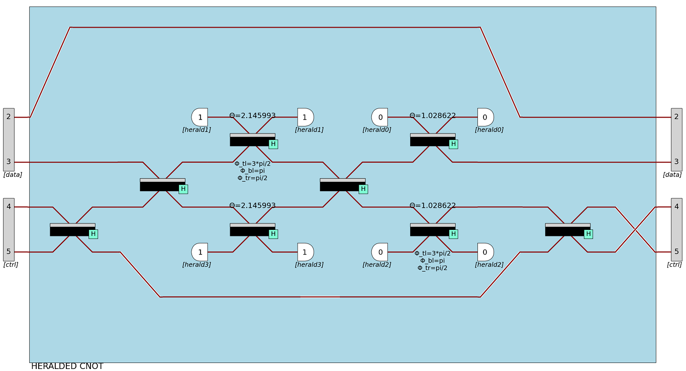
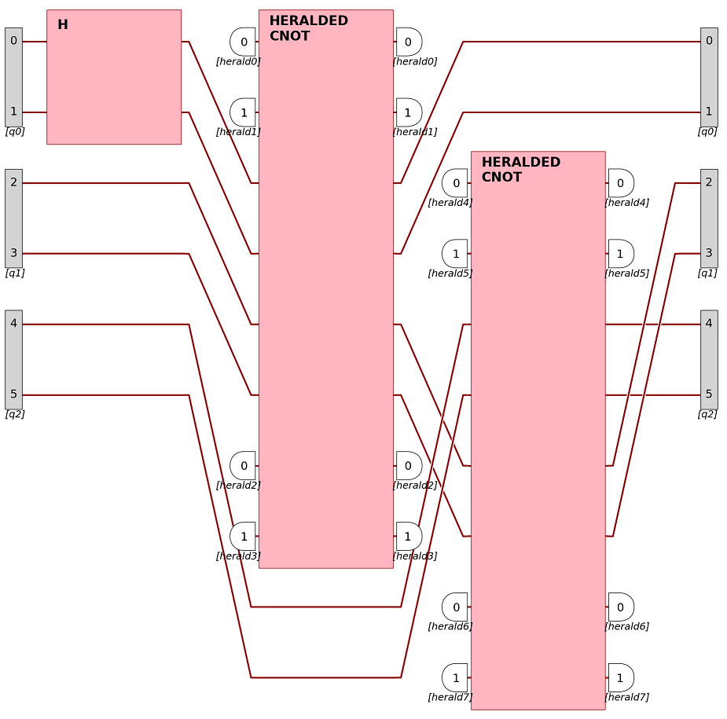

Run quantum algorithms
======================

Perceval provides a processor-centric syntax to run an algorithm locally or remotely, on a simulator or an actual QPU.

Build a processor
------------------

A :ref:`Processor` is a composite element aiming at simulating an actual QPU, in real world conditions.

* It holds a single photon :ref:`Source`
* It is a composition of unitary circuits and non-unitary components
* Input and output ports can be defined, with encoding semantics
* Logical post-processing can be set-up through heralded modes (ancillas) and a final post-selection function
* It contains the means of simulating the setup it describes with one of :ref:`The Backends` which are provided

Create a processor from scratch
^^^^^^^^^^^^^^^^^^^^^^^^^^^^^^^

As an example, let's create locally a heralded CNOT gate from its circuit:

>>> import perceval as pcvl
>>> from perceval.components import BS, PERM, Port, Encoding
>>> c_hcnot = (pcvl.Circuit(8, name="Heralded CNOT")
...            .add((0, 1, 2), PERM([1, 2, 0]))
...            .add((4, 5), BS.H())
...            .add((5, 6, 7), PERM([1, 2, 0]))
...            .add((3, 4), BS.H())
...            .add((2, 3), BS.H(theta=self.theta1, phi_bl=np.pi, phi_tr=np.pi/2, phi_tl=-np.pi/2))
...            .add((4, 5), BS.H(theta=self.theta1))
...            .add((3, 4), BS.H())
...            .add((5, 6, 7), PERM([2, 1, 0]))
...            .add((1, 2), PERM([1, 0]))
...            .add((2, 3), BS.H(theta=self.theta2))
...            .add((4, 5), BS.H(theta=self.theta2, phi_bl=np.pi, phi_tr=np.pi/2, phi_tl=-np.pi/2))
...            .add((5, 6), PERM([1, 0]))
...            .add((4, 5), BS.H())
...            .add((4, 5), PERM([1, 0]))
...            .add((0, 1, 2), PERM([2, 1, 0])))
>>> processor_hcnot = pcvl.Processor("SLOS", c_hcnot)
>>> processor_hcnot.add_herald(0, 0)
...                .add_herald(1, 1)
...                .add_port(2, Port(Encoding.DUAL_RAIL, 'data'))
...                .add_port(4, Port(Encoding.DUAL_RAIL, 'ctrl'))
...                .add_herald(6, 0)
...                .add_herald(7, 1)
>>> pcvl.pdisplay(processor_hcnot, recursive=False)

    Heralded CNOT gate rendering - heralded modes are not shown for readability

Processor composition
^^^^^^^^^^^^^^^^^^^^^

Processors can also be composed with one another. That's for example, how :ref:`Qiskit converter` outputs a complex
preconfigured processor from a gate-based circuit.

    A processor composed of a Hadamard gate and two heralded CNOT gates.

Remote processors
^^^^^^^^^^^^^^^^^

RemoteProcessor class is the entry point for sending a computation on a remote platform (that can be a simulator or a
QPU). An access token on Quandela Cloud with rights to run on any existing platform is required to follow this tutorial:
:ref:`Remote computing with Perceval`

No processor is able to execute all types of command. For instance, a real QPU is natively able to sample output
detections, but not to compute probabilities of output states versus an input state.

When creating a RemoteProcessor, you can query its capabilities

>>> token_qcloud = 'YOUR_API_KEY'
>>> remote_simulator = RemoteProcessor("sim:ascella", token_qcloud)
>>> print(remote_simulator.available_commands)
['probs']

This means, `sim:ascella` is only able to answer to `probs` commands (i.e. compute the probability of all output states
given an input state).

Work with algorithms
--------------------

All algorithms take either a local or a remote processor as parameter, in order to work on it. A `Processor` runs
simulations on the local computer while a `RemoteProcessor` turns Perceval into a client of the Quandela Cloud server,
and the computation is performed on the selected platform.

However, for user experience, an algorithm has the same behavior be it run locally or remotely: every call to an
algorithm command returns a `Job` hiding this complexity.

>>> local_p = pcvl.Processor("CliffordClifford2017", pcvl.BS())
>>> local_p.with_input(pcvl.BasicState('|1,1>'))
>>> sampler = pcvl.algorithm.Sampler(local_p)
>>> local_job = sampler.sample_count(10000)

Here, the computation has not started yet, but it's been prepared in `local_job` to run locally.

>>> token_qcloud = 'YOUR_API_KEY'
>>> remote_p = pcvl.RemoteProcessor("sim:clifford", token_qcloud)
>>> remote_p.set_circuit(pcvl.BS())
>>> remote_p.with_input(pcvl.BasicState('|1,1>'))
>>> sampler = pcvl.algorithm.Sampler(remote_p)
>>> remote_job = sampler.sample_count(10000)

Here, the computation was set-up to run on `sim:clifford` platform when `remote_job` is executed.

Handle a Job object
^^^^^^^^^^^^^^^^^^^

Both `LocalJob` and `RemoteJob` share the same interface.

* Execute a job synchronously

>>> results = job.execute_sync(*args)  # Executes the job synchronously (blocks the execution until results are ready)
>>> results = job(*args)  # Same as above

* Execute a job asynchronously

>>> job.execute_async(*args)

This call is non-blocking, however results are not available right when this line has finished executing. The job object
provides information on the progress.

>>> while not job.is_complete:  # Check if the job has finished running
...     print(job.status.progress)  # Progress is a float value between 0. and 1. representing a progress from 0 to 100%
...     time.sleep(1)
>>> if job.is_failed:  # Check if the job has failed
...     print(job.status.stop_message)  # If so, print the reason
>>> results = job.get_results()  # Retrieve the results if any

Typically, the results returned by an algorithm is a Python dictionary with a 'results' key, plus additional data.

* An job cancelation can be request programmatically by the user

>>> job.cancel()  # Ask for job cancelation. The actual end of the execution may take some time

When a job is canceled, it may contain partial results. To retrieve them, call `get_results()`.

* A remote job can be resumed.

>>> token_qcloud = "YOUR_API_KEY"  # A valid token is required
>>> remote_processor = pcvl.RemoteProcessor("any:worker", token_qcloud)
>>> job = remote_processor.resume_job("job_id")  # You can find job IDs on Quandela Cloud's website

Provided algorithms
-------------------

Algorithms provided with Perceval are available in the Python package `perceval.algorithm`. They can be as simple as
a `sampler` algorithm, as specific as `QRNG` (certified random number generator), which would work only on some
certified QPUs.

Sampler
^^^^^^^

The `Sampler` is the simplest algorithm provided, yet an important gateway to using processors.

All processors do not share the same capabilities. For instance, a QPU is able to sample, but not to sample output
probabilities given an input. The `Sampler` algorithm allows the user to call any of the three main `primitives` on any
processor:

>>> sampler = pcvl.algorithm.Sampler(processor)
>>> samples = sampler.samples(10000)  # Sampler exposes 'samples' primitive returning a list of ordered samples
>>> print(samples['results'])
[|0,1,0,1,0,0>, |0,1,0,0,1,0>, |0,2,0,0,0,0>, |0,0,0,1,0,0>, |0,1,0,1,0,0>, |0,1,0,1,0,0>, |0,1,1,0,0,0>, |0,1,0,1,0,0>, |0,1,1,0,0,0>, |0,1,0,1,0,0>, ... (size=10000)]
>>> sample_count = sampler.sample_count(10000)  # Sampler exposes 'sample_count' returning a dictionary {state: count}
>>> prob_dist = sampler.probs()  # Sampler exposes 'probs' returning a probability distribution of all possible output states

When a `primitive` is not available on a processor, a conversion occurs automatically after the computation is complete.
