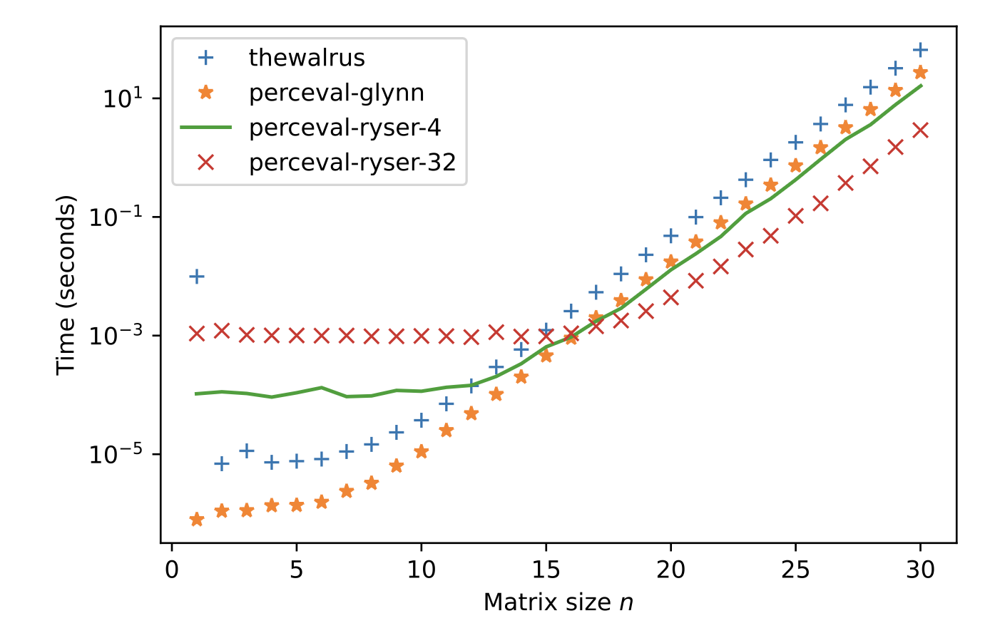

Simulation Back-ends
====================

To run a simulation, computing back-ends implemented from state of the art algorithms are available in Perceval.
Each of these back-ends has different capabilities that we describe in that section.

All Perceval simulation back-ends act on perfect input Fock states on a fixed unitary circuit.
Nonetheless, Perceval aims at supporting noisy and non-unitary simulations. These real life use cases are covered in the
next part of the tutorial.

I. Back-end features
--------------------

Sampling a.k.a Weak Simulation
^^^^^^^^^^^^^^^^^^^^^^^^^^^^^^

Sampling is the simulation task closest to the actual running of a physical circuit. Given known input states,  the
sampling will produce output states one at a time as it would be observed by ideal detectors. Sampling is considered
as a weak simulation of a circuit, since it does not give explicit output distribution, nor the nature of the mixture
states generated by the circuit but a mere observation of individual outputs.

Sampling has been studied in length (see :cite:t:`clifford_classical_2018`, :cite:t:`clifford2020faster`), in the context of Boson Sampling, as a classical
computing challenge pushing further the limit of the quantum supremacy.

Strong Simulation
^^^^^^^^^^^^^^^^^

Strong(er) Simulation (see :cite:t:`heurtel2022`) of a circuit should provide an access to complete distribution and nature of the output state.
Compared to *Sampling*, circuit designer are interested in the actual probabilistic distribution of the outputs and their
exact characteristic.

In particular, for a :math:`m` port circuit, one would like to know the exact expected probability of detecting photons
on a given port, and not a mere estimation based on sampling observations. We also differentiate here the ability of getting the
probability (or probability amplitude) of a single output, and the possibilities of getting probabilities of all the different
outputs for a give input state.

Also, even for a simple circuit showing an equiprobable probability of detecting
:math:`\ket{0,1}` and :math:`\ket{1,0}`, we would want to know if the output is :math:`\frac{1}{\sqrt 2}(\ket{0,1}+\ket{1,0})` or
:math:`\frac{1}{\sqrt 2}(\ket{0,1}-\ket{1,0})` which are very distinct states.

Finally, a fine-grained simulation would need not only to give output state probability but also *probability amplitude*.
Indeed, probability amplitude is required for further evolution of the output states, but also analysis of polarization
for circuit with polarization support, etc.

II. Back-end comparison
-----------------------

Perceval has 6 different built-in back-ends with the support of optimized C++ library.

Comparison Table
^^^^^^^^^^^^^^^^

.. list-table::
   :header-rows: 1
   :stub-columns: 1
   :width: 100%
   :align: center

   * - Features \ Name
     - :ref:`CliffordClifford2017`
     - :ref:`SLOS`
     - :ref:`Naive`
     - :ref:`NaiveApprox`
     - :ref:`MPS`
     - :ref:`SLAP`
   * - Sampling Efficiency
     - :math:`\mathrm{O}(n2^n+poly(m,n))`
     - :math:`\mathrm{O}(mC_n^{n+m-1})`
     - *N/A* [1]_
     - *N/A* [1]_
     - *N/A* [1]_
     - Theoretically :math:`\mathrm{O}(n2^n+poly(m,n))`
   * - Single output Efficiency
     - *N/A*
     - *N/A*
     - :math:`\mathrm{O}(n2^n)`
     - :math:`\mathrm{O}(n)`
     - :math:`\mathrm{O}(N_cC_n^{n+m-1})`
     - :math:`\mathrm{O}(n2^n)`
   * - Full Distribution Efficiency
     - *N/A*
     - :math:`\mathrm{O}(nC_n^{n+m-1})`
     - :math:`\mathrm{O}(n2^nC_n^{n+m-1})`
     - :math:`\mathrm{O}(nC_n^{n+m-1})`
     - :math:`\mathrm{O}(N_cC_n^{n+m-1})`
     - :math:`\mathrm{O}(\begin{equation} 2n\times \sum_{k=1}^n  \binom{n-1}{k-1} \times \binom{m+k-1}{m-1} \label{eq:complex} \end{equation})`
   * - Probability Amplitude
     - **No**
     - **Yes**
     - **Yes**
     - **Yes**
     - **Yes**
     - **Yes**
   * - Practical Limits
     - :math:`n\approx30`
     - :math:`n,m<20`
     - :math:`n\approx30`
     -
     -
     - :math:`n,m<20`

where:

* :math:`n` is the number of photons
* :math:`m` is the number of modes
* :math:`N_c` is the number of elementary circuits

CliffordClifford2017
^^^^^^^^^^^^^^^^^^^^

This backend is the implementation of the algorithm introduced in :cite:t:`clifford_classical_2018`.
The algorithm, applied to Boson Sampling, aims to *produce provably correct random samples from a particular quantum mechanical distribution*.
Its time and space complexity are respectively :math:`\mathrm{n2^n+mn^2}` and :math:`\mathrm{m}` (in addition to matrix storing).
The algorithm has been implemented in C++, and uses an adapted Glynn algorithm :cite:t:`glynn2010permanent` to efficiently
compute :math:`n` simultaneous *sub-permanents*.

Recently, the same authors have proposed a faster algorithm in :cite:t:`clifford2020faster` with an average time
complexity of :math:`\mathrm{n\rho_\theta^n}` for a number of modes :math:`m=\theta n` which is linear in the number of
photons :math:`n`, where:

.. math::
    \rho_\theta = \frac{(2\theta+1)^{2\theta+1}}{(4\theta)^{\theta}(\theta+1)^{\theta+1}}

For example, if we were to work with dual rail path encoding (ignoring for now the number of auxiliary modes required),
we would typically work with :math:`\theta=2`, and the average performance is then
:math:`\mathrm{n(\frac{5^5}{8^23^3})^n} \approx \mathrm{n1.8^n}`.

See also, its code reference: :ref:`Clifford2017Backend`

SLOS
^^^^

The Strong Linear Optical Simulation ``SLOS`` algorithm developed by a subset of the present authors is introduced in
:cite:t:`heurtel2022`. It unfolds the full computation path in memory, leading to a remarkable time complexity of
:math:`\mathrm{nC_n^{n+m-1}}` for computing the full distribution. The current implementation also allows restrictive
sets of outputs, with average computing time in :math:`\mathrm{n\rho_\theta^n}` for single output computation. As
discussed in :cite:t:`heurtel2022`, Boson Sampling with ``SLOS`` is possible with the time complexity of
:cite:t:`clifford2020faster`, though it has not yet been implemented in the current version of Perceval.

The tradeoff in this approach is a huge memory usage in :math:`\mathrm{nC^{n+m-1}_n}` that limits usage on personal
computers to circuits with :math:`\approx 20` photons and to :math:`\approx 24` photons on super-computers.

See also, its code reference: :ref:`SLOSBackend`

SLAP
^^^^

The Simulator of LAttice of Polynomials ``SLAP`` algorithm computes all output probability amplitudes at once by
iterating over a lattice of intermediary results representation.
It is designed to require less memory than ``SLOS`` (:math:`2^n` complex values) at the cost of a slightly higher
computation time. The algorithm is introduced in :cite:t:`goubault2025`.

This feature is still under development, however, in the future, we expect this backend:
  * to reach a sampling efficiency of :math:`\mathrm{O}(n2^n+poly(m,n))`
  * to be faster than SLOS in the regime :math:`m >> n`

See also, its code reference: :ref:`SLAPBackend`

Naive
^^^^^

This backend implements direct permanent calculation and is therefore suited for single output probability computation
with small memory cost. Both Ryser's (:cite:t:`ryser1963combinatorial`) and Glynn's (:cite:t:`glynn2010permanent`) algorithms
have been implemented. Extra-care has been taken on the implementation of these algorithms, with usage of different
optimisation techniques including native multithreading and SIMD vectorisation primitives. Benchmarking of these
algorithms and comparison with the implementation present in the
`The Walrus library <https://github.com/XanaduAI/thewalrus>`_ is provided in following figure:

    Comparison of the average time [#]_ to calculate a permanent of an :math:`n\times n` Haar random matrix. The processor
    is a 32 core, 3.1GHz Intel Haswell. For *The Walrus*, version 0.19 is used and installed from
    `pypi <https://pypi.org>`_. The Ryser implementation is run on 4 or 32 threads.
    The Glynn implementation is run on a single thread.
    What is interesting to note is that all implementations have convergence to the theoretical performance but the
    factor between optimised and less optimised implementation still makes a perceptible time difference for the end-user.

See also, its code reference: :ref:`NaiveBackend`

NaiveApprox
^^^^^^^^^^^

This backend does the same computations as Naive, but uses Gurvits estimate to compute the permanent (see :cite:t:`gurvits2002`).
Aside of usual probability() and prob_amplitude() methods, it offers a 99% confidence interval on the probability, or a
99% sure error bound on the amplitude.
A better accuracy can be obtained with a higher iteration count.

With this approximated backend, you can achieve a few probability estimates for high photon counts.

See also, its code reference: :ref:`NaiveApproxBackend`

MPS
^^^

Matrix Product State (MPS)  is based on a type of tensor network simulation, which gives an approximation of the output
states (see :cite:t:`schollwock2011density` and :cite:t:`oh2021classical`).
As the Stepper, MPS backend does the computation on each component of the circuits one-by-one, and not on the whole unitary, but has the unique feature of performing approximate state evolution.
The states are represented by tensors, which are then updated at each component.
These tensors can be seen as a big set of matrices, and the approximation is done by choosing the dimension of these matrices, called the *bond* dimension.

See also, its code reference: :ref:`MPSBackend`

.. rubric:: Footnotes

.. [1] Those backends technically support sampling, but to do so, they need to compute the full output distribution then
       sample on it, which is totally inefficient.
.. [#] Following the methodology presented at https://the-walrus.readthedocs.io/en/latest/gallery/permanent_tutorial.html.
