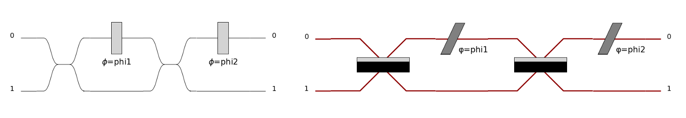
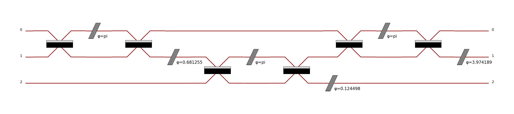
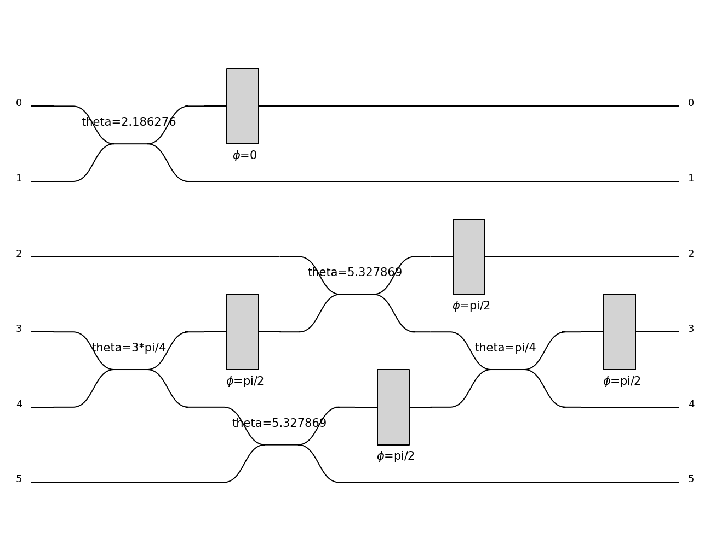

Circuits
========

Circuits Overview
-----------------

The concept of *circuit* is central in Perceval and the key component of the instrumentalist and the theoretician
building a photonic quantum device. Perceval is giving concrete tools to reproduce an optical set-up in an optic
laboratory with beams, mirrors and physical component but also photonic chips like a generic interferometer.

.. list-table::
   :width: 100%

   * - .. figure:: _static/img/grover-circuit.png
         :align: center
         :width: 500

         Optimized Grover algorithm as proposed in :cite:p:`kwiat_grovers_2000`.
     - .. figure:: _static/img/grover-perceval.png
         :align: center
         :width: 500

         The equivalent circuit in Perceval

   * - .. figure:: _static/img/quandela-4-mode-chip.png
         :align: center

         A 4-mode photonic chip (*Copyright Quandela 2022*)
     - .. figure:: _static/img/quandela-4-mode-chip-circuit.png
         :align: center
         :height: 319

         The equivalent circuit in Perceval

.. kept as comment

   * - .. figure:: _static/img/grover-circuit.png
         :align: center
	 :width: 500

         Optimized Grover algorithm proposed in [Kwiat2000]_.
     - **TODO**: The equivalent PHYS circuit

What is a Circuit ?
-------------------

In Perceval a *circuit* represents a setup of optical components, used
to guide and act on photons.

A circuit has a fixed number of *spatial modes* (sometimes also called
*pathes* or *ports*) :math:`m`, which is the same for input as for output
spatial modes.

Simple examples of circuits are common optical devices such as beam
splitters, phase shifters, or wave plates. Perceval provides a
collection of these (see :ref:`Components`).

   A beam splitter as a circuit in Perceval.

In particular, note that:

* *sources* aren't circuits, since they do not have input spatial
  modes (they don't guide or act on incoming photons, but *produce*
  photons that are sent into a circuit),
* *detectors* aren't circuits either, for similar reasons

.. warning::
   An *optical circuit* (just called
   "circuit" here) isn't the same as a *quantum circuit*. Quantum
   circuits act on *qubits*, i.e. abstract systems in a 2-dimentional
   Hilbert space; while optical circuits act on *photons*
   distributed in spatial modes. It is possible to simply encode
   qubits with photons in an optical circuit; some encodings are
   presented in the :ref:`Basics` section.

.. figure:: _static/img/basic-circuit.png
  :scale: 50 %
  :align: center

  A simple circuit with 4 spatial modes, containing a beam splitter
  (being itself a circuit) between second and third spatial modes

Circuits can be *combined* together and used as building blocks to
construct larger circuits. In the example above, a beam splitter,
which is a builtin circuit with 2 spatial modes, has been used in a
larger circuit with 4 spatial modes.

The lines, corresponding to spatial modes, are representing optical
fibers on which photons are sent from the left to the right.

.. The way these lines are used to represent
   logical modes are up to the circuit design.

Building a Circuit
------------------

Each circuit corresponds to a ``Circuit`` object.
To instantiate a circuit, simply pass the number of pathes as an argument:

>>> # create a new circuit with 3 spatial modes
>>> my_circuit = pcvl.Circuit(3)

.. warning::

  Ports are using `0-based numbering <https://en.wikipedia.org/wiki/Zero-based_numbering>`_ - so port 0 is
  corresponding to the first line, ... port :math:`(m-1)` is corresponding to the :math:`m`-th line.

Predefined Circuits
^^^^^^^^^^^^^^^^^^^

Perceval provides two libraries of predefined circuits, named
``perceval.lib.phys`` and ``perceval.lib.symb`` (or shortly ``phys``
and ``symb``):

>>> import perceval.lib.phys as phys
>>> import perceval.lib.symb as symb

These libraries contain simple circuits, which differ by their visual
identities and specific mathematical definitions.

* ``symb`` provides circuits with generally less parameters. This is
  useful to build generic optical circuits which implement quantum
  circuits, and perform symbolic computation.
* ``phys`` provides circuits with more parameters, which allow a
  sharper modelisation of the components in a physical experiment.

For instance, the following table shows the respective definition of the unitary matrix of a beam splitter in the
``phys`` and the ``symb`` library:

.. list-table::
 :header-rows: 1
 :width: 50%
 :align: center

 * - Library
   - Definition
   - Representation

 * - ``symb``
   - :math:`\left[\begin{matrix}\cos{\left(\theta \right)} & i e^{- i \phi} \sin{\left(\theta \right)}\\i e^{i \phi} \sin{\left(\theta \right)} & \cos{\left(\theta \right)}\end{matrix}\right]`
   - .. image:: _static/library/symb/bs.png

 * - ``phys``
   - :math:`\left[\begin{matrix}e^{i \phi_{a}} \cos{\left(\theta \right)} & i e^{i \phi_{b}} \sin{\left(\theta \right)}\\i e^{i \left(\phi_{a} - \phi_{b} + \phi_{d}\right)} \sin{\left(\theta \right)} & e^{i \phi_{d}} \cos{\left(\theta \right)}\end{matrix}\right]`
   - .. image:: _static/library/phys/bs.png

Also following figure shows the same Mach Zehnder Interferometer circuit represented with the ``symb`` and the
``phys`` library:

See :ref:`Components` for an overview of the circuits provided by
``symb`` and ``phys``.

.. tip::

   You can play with the python import namespace ``as`` to define a circuit without explicit reference to one or the
   other library. For instance, the following code defines a Mach Zehnder interferometer

   >>> import perceval.lib.phys as plib
   >>> mzi = (pcvl.Circuit(m=2, name="mzi")
   ...        .add((0, 1), plib.BS())
   ...        .add(0, plib.PS(pcvl.Parameter("phi1")))
   ...        .add((0, 1), plib.BS())
   ...        .add(0, plib.PS(pcvl.Parameter("phi2"))))

   You would only need to change the first line to switch from one library to the other.

.. Elementary Circuits

   The simplest circuits are the predefined :ref:`Components` that are included in Perceval.

   To define a circuit, you simply need to instantiate the corresponding object:

   >>> bs = phys.BS()

.. And you can use it the same way you will use a complex circuit as described in :ref:`Complex Circuits`.

In addition to the generic properties of complex circuits, elementary
circuits defined in ``phys`` and ``symb`` also have the following
features:

* **Definition**: ``definition()`` method gives the definition of the circuit - allowing to know in particular, the parameters to use
  and the way the unitary matrix is computed.

  >>> pcvl.pdisplay(phys.BS().definition())
  ⎡cos(theta)               I*exp(-I*phi)*sin(theta)⎤
  ⎣I*exp(I*phi)*sin(theta)  cos(theta)              ⎦

* **Parameterization**: most of the elementary circuits are defined by parameters. For instance a phase shifter will take
  the phase :math:`\phi` as a parameter. You can either initialize these parameters with a fixed numeric value:
  ``phys.PS(1.57)``, with a symbolic value ``phys.PS(sp.pi/2)`` or with a non fixed parameter:
  ``phys.PS(pcvl.P("alpha"))``. See :ref:`Parameters` for more information.

Defining circuits from a unitary matrix
^^^^^^^^^^^^^^^^^^^^^^^^^^^^^^^^^^^^^^^

You can also define any circuit directly from a unitary matrix.  In
Perceval a unitary matrix corresponds to a ``Matrix`` object, which
can simply created from a list matrix. The code:

>>> M = pcvl.Matrix([[0, 0, 1],
...                  [0, 1, 0],
...                  [1, 0, 0]])

corresponds to the unitary matrix: :math:`\left[\begin{matrix}0 & 0 &
1\\0 & 1 & 0\\1 & 0 & 0\end{matrix}\right]`

The following then defines a circuit corresponding to this matrix:

>>> c1 = pcvl.Circuit(U=M)

You might also want to decompose the unitary matrix into a physical circuit using decomposition elements.
Let us define for instance:

>>> ub = Circuit(2, name="ub") // symb.BS() // (0, symb.PS(phi=pcvl.Parameter("φ_a"))) // symb.BS() // (1, symb.PS(phi=pcvl.Parameter("φ_b")))

Then you can build a circuit using the method :meth:`perceval.components.circuit.Circuit.decomposition`:

>>> c2 = pcvl.Circuit.decomposition(M, mzi, shape="triangle")
>>> c2.describe()
Circuit(3).add((0, 1), phys.BS()).add(0, phys.PS(phi=pi)).add((0, 1), phys.BS()).add(1, phys.PS(phi=0.681255)).add((1, 2), phys.BS()).add(1, phys.PS(phi=-pi)).add((1, 2), phys.BS()).add(2, phys.PS(phi=0.124498)).add((0, 1), phys.BS()).add(0, phys.PS(phi=pi)).add((0, 1), phys.BS()).add(1, phys.PS(phi=3.974189))
>>> pcvl.pdisplay(c2)

Some additional parameters can simplifiy the decomposition:

* `permutation`: if set to a permutation component, permutations will be used when possible instead of a unitary block

>>> import perceval as pcvl
>>> import perceval.lib.symb as symb
>>> C1 = pcvl.Circuit.decomposition(symb.PERM([3, 2, 1, 0]).compute_unitary(False),
>>>                                 symb.BS(theta=pcvl.Parameter("theta")),
>>>                                 permutation=symb.PERM,
>>>                                 shape="triangle")
>>>pcvl.pdisplay(C1)

.. image:: _static/img/permutations-perm.png
   :width: 8cm

* `constraints`: you can provide a list of constraints on the different parameters of the unitary blocks to try to find
  circuits with constrained parameters. Each constraint is a t-uple of `None` or numerical value. When decomposing the
  circuit, the parameters will be searched iteratively in the constrained spaces. For instance: `[(0, None), (np.pi/2, None), (None, None)]`
  will allow to look for parameters pairs where the first parameter is 0 or :math:`pi/2`, or any value if
  no solution is found with the first constraints.

>>> U=1/3*np.array([[np.sqrt(3),-np.sqrt(6)*1j,0,0,0,0],
>>>                 [-np.sqrt(6)*1j,np.sqrt(3),0,0,0,0],
>>>                 [0,0,np.sqrt(3),-np.sqrt(3)*1j,-np.sqrt(3)*1j,0],
>>>                 [0,0,-np.sqrt(3)*1j,np.sqrt(3),0,np.sqrt(3)],
>>>                 [0,0,-np.sqrt(3)*1j,0,np.sqrt(3),-np.sqrt(3)],
>>>                 [0,0,0,np.sqrt(3),-np.sqrt(3),-np.sqrt(3)]])
>>> ub = symb.BS(theta=pcvl.P("theta"))//symb.PS(phi=pcvl.P("phi"))
>>> C1 = pcvl.Circuit.decomposition(U,
>>>                                 ub,
>>>                                 shape="triangle", constraints=[(None,0),(None,np.pi/2),
>>>                                                                (None,3*np.pi/2),(None,None)])

* `phase_shifter_fn`: if you provide a phase-shifter to this parameter, the decomposition will add a layer of phases
  making the decomposed circuit strictly equivalent to the initial unitary matrix. In most cases, you can however omit
  this layer.

* finally, you can also pass simpler unitary blocks - for instance a simple beamsplitter without phase, however in these
  cases, you might not obtain any solution in the decomposition

Complex Circuits
^^^^^^^^^^^^^^^^

Assembling circuits
"""""""""""""""""""

A circuit is defined by using :ref:`Circuit` object as following:

>>> c = pcvl.Circuit(m)

Where ``m`` is the number of modes of the circuit. See :ref:`Circuit` for additional parameters.

Then components of the circuit are added with the ``add`` primitive:

>>> c.add((0, 1), phys.BS())

Where:

* The first parameter is either the *port range* (here ports 0 and 1), or the upper where the component should be added.
  The previous declaration is equivalent to:

  >>> c.add(0, phys.BS())

* The second parameter is a circuit, it can be an elementary circuit as in our example, or another complex circuit.

.. tip::

  It is possible to add multiple components in a single statement allowing for simpler circuit declaration:

  >>> mzi = pcvl.Circuit(2).add(0, plib.BS()).add(0, plib.PS(pcvl.Parameter("phi1")))\
  ...                      .add(0, plib.BS()).add(0, plib.PS(pcvl.Parameter("phi2"))))

  alternatively, you can also use ``//`` notation for more compact definition, and start from unitary circuit:

  >>> mzi = plib.BS() // (0, plib.PS(pcvl.Parameter("phi1"))) // plib.BS() // (0, plib.PS(pcvl.Parameter("phi2")))

Generic Interferometer
""""""""""""""""""""""

It is also possible to define generic interferometers with the static method
:meth:`perceval.components.circuit.Circuit.generic_interferometer`.

For instance the following defines a triangular interferometer on 8 modes using a beam splitter
and a phase shifter as base components:

>>> c = pcvl.Circuit.generic_interferometer(8,
...                                         lambda i: symb.BS() // symb.PS(pcvl.P("φ%d" % i)),
...                                         shape="triangle")
>>> pcvl.pdisplay(c)

.. figure:: _static/img/generic-interferometer.png
  :align: center
  :width: 75%

Sub-circuits
^^^^^^^^^^^^

When you assemble to build a circuit, you can naturally include a complex circuit into another one:

>>> bsps = phys.BS().add(0, phys.PS(sp.pi/2))
>>> c = pcvl.Circuit(3).add(0, bsps).add(1, bsps)
>>> pcvl.pdisplay(c)

.. image:: _static/img/wmerge.png
   :width: 300px

By default, the new circuits merge all the circuits into a single one by using ``merge=False`` parameter:

>>> c = pcvl.Circuit(3).add(0, bsps).add(1, bsps, merge=False)
>>> pcvl.pdisplay(c)

.. image:: _static/img/wnomerge.png
   :width: 300px

This can be particularly useful to get a better visual organization of large circuit.

Unitary Matrices
----------------

Except for circuits using :ref:`Time Delay`, any circuit can be converted into its unitary matrix. Depending if your
circuit is using :ref:`Parameters` or not, the unitary matrix will be symbolic or numeric.

>>> chip4mode = pcvl.Circuit(m=4, name="QChip")
>>> phis = [pcvl.Parameter("phi1"), pcvl.Parameter("phi2"),
...         pcvl.Parameter("phi3"), pcvl.Parameter("phi4")]
>>> (chip4mode
...  .add((0, 1), symb.BS()).add((2, 3), symb.BS()).add((1, 2), symb.PERM([1, 0]))
...  .add(0, symb.PS(phis[0])).add(2, symb.PS(phis[2])).add((0, 1), symb.BS())
...  .add((2, 3), symb.BS()).add(0, symb.PS(phis[1])).add(2, symb.PS(phis[3]))
...  .add((0, 1), symb.BS()).add((2, 3), symb.BS()))
>>> pcvl.pdisplay(chip4mode.U)

:math:`\left[\begin{matrix}\frac{\sqrt{2} \left(- e^{i \phi_{1}} + e^{i \left(\phi_{1} + \phi_{2}\right)}\right)}{4} & \frac{\sqrt{2} i \left(- e^{i \phi_{1}} + e^{i \left(\phi_{1} + \phi_{2}\right)}\right)}{4} & \frac{\sqrt{2} i \left(e^{i \phi_{2}} + 1\right)}{4} & - \frac{\sqrt{2} \left(e^{i \phi_{2}} + 1\right)}{4}\\\frac{\sqrt{2} i \left(e^{i \phi_{1}} + e^{i \left(\phi_{1} + \phi_{2}\right)}\right)}{4} & - \frac{\sqrt{2} \left(e^{i \phi_{1}} + e^{i \left(\phi_{1} + \phi_{2}\right)}\right)}{4} & \frac{\sqrt{2} \left(1 - e^{i \phi_{2}}\right)}{4} & \frac{\sqrt{2} i \left(1 - e^{i \phi_{2}}\right)}{4}\\\frac{\sqrt{2} i \left(- e^{i \phi_{3}} + e^{i \left(\phi_{3} + \phi_{4}\right)}\right)}{4} & \frac{\sqrt{2} \left(- e^{i \phi_{3}} + e^{i \left(\phi_{3} + \phi_{4}\right)}\right)}{4} & - \frac{\sqrt{2} \left(e^{i \phi_{4}} + 1\right)}{4} & \frac{\sqrt{2} i \left(e^{i \phi_{4}} + 1\right)}{4}\\- \frac{\sqrt{2} \left(e^{i \phi_{3}} + e^{i \left(\phi_{3} + \phi_{4}\right)}\right)}{4} & \frac{\sqrt{2} i \left(e^{i \phi_{3}} + e^{i \left(\phi_{3} + \phi_{4}\right)}\right)}{4} & \frac{\sqrt{2} i \left(1 - e^{i \phi_{4}}\right)}{4} & \frac{\sqrt{2} \left(1 - e^{i \phi_{4}}\right)}{4}\end{matrix}\right]`

See :meth:`perceval.components.circuit.Circuit.compute_unitary` for more information.

Circuit Rewriting
-----------------

To enable circuit rewriting operations introduced in :cite:p:`clement2022lov`, the following methods are available for
matching a specific pattern in a circuit, and to replace the corresponding sub-circuit by an equivalent circuit.

The complete sequence is the following:

>>> while True:
...    # identify one instance of the parameterized "pattern" within a circuit
...    matched = circuit.match(pattern, browse=True)
...    # check if an occurence was found
...    if matched is None:
...       break
...    # transform the list of matched components into a sub-circuit
...    idx = a.isolate(list(matched.pos_map.keys()))
...    # check if an equivalent "rewrite" circuit can be found
...    res = optimize(rewrite, v, frobenius, sign=-1)
...    # check if we can rewrite this pattern closely enough to original circuit, here with frobenius distance
...    if res.fun > 1e-6:
...        break
...    # replace the subcircuit by a copy of the pattern
...    a.replace(idx, rewrite.copy(), merge=True)
...    # reset all parameters of pattern and rewrite circuit that have been instantiated by
...    # the matching/optimize process
...    pattern.reset_parameters()
...    rewrite.reset_parameters()

See *Reference to Notebook* for a complete functional example.
