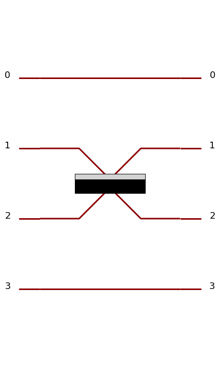

Circuits
========

Circuits Overview
-----------------

The concept of *circuit* is central in Perceval and the key component of the instrumentalist and the theoretician
building a photonic quantum device. Perceval is giving concrete tools to reproduce an optical set-up in an optic
laboratory with beams, mirrors and physical component but also photonic chips like a generic interferometer.

.. list-table::
   :width: 100%

   * - .. figure:: _static/img/grover-circuit.png
         :align: center
         :width: 500

         Optimized Grover algorithm as proposed in :cite:p:`kwiat_grovers_2000`.
     - .. figure:: _static/img/grover-perceval.png
         :align: center
         :width: 500

         The equivalent circuit in Perceval

   * - .. figure:: _static/img/quandela-4-mode-chip-circuit.png
         :align: center

         A 4-mode photonic chip (*Copyright Quandela 2022*)
     - .. figure:: _static/img/quandela-4-mode-chip-circuit.png
         :align: center
         :height: 319

         The equivalent circuit in Perceval

.. kept as comment

   * - .. figure:: _static/img/grover-circuit.png
         :align: center
         :width: 500

         Optimized Grover algorithm proposed in [Kwiat2000]_.
     - **TODO**: The equivalent PHYS circuit

What is a Circuit ?
-------------------

In Perceval a *circuit* represents a setup of optical components, used
to guide and act on photons.

A circuit has a fixed number of *spatial modes* (sometimes also called
*paths*) :math:`m`, which is the same for input as for output
spatial modes.

Simple examples of circuits are common optical devices such as beam
splitters, phase shifters, or wave plates. Perceval provides a
collection of these (see :ref:`Components`).

.. figure:: _static/library/phys/bs.png
   :scale: 50 %
   :align: center

   A beam splitter as a circuit in Perceval.

In particular, note that:

* *sources* aren't circuits, since they do not have input spatial
  modes (they don't guide or act on incoming photons, but *produce*
  photons that are sent into a circuit),
* *detectors* aren't circuits either, for similar reasons

.. warning::
   An *optical circuit* (just called
   "circuit" here) isn't the same as a *quantum circuit*. Quantum
   circuits act on *qubits*, i.e. abstract systems in a 2-dimensional
   Hilbert space; while optical circuits act on *photons*
   distributed in spatial modes. It is possible to simply encode
   qubits with photons in an optical circuit; some encodings are
   presented in the :ref:`Basics` section.

  A simple circuit with 4 spatial modes, containing a beam splitter
  (being itself a circuit) between second and third spatial modes

Circuits can be *combined* together and used as building blocks to
construct larger circuits. In the example above, a beam splitter,
which is a builtin circuit with 2 spatial modes, has been used in a
larger circuit with 4 spatial modes.

The lines, corresponding to spatial modes, are representing optical
fibers on which photons are sent from the left to the right.

.. The way these lines are used to represent
   logical modes are up to the circuit design.

Building a Circuit
------------------

Each circuit corresponds to a ``Circuit`` object.
To instantiate a circuit, simply pass the number of modes as an argument:

>>> # create a new circuit with 3 spatial modes
>>> my_circuit = pcvl.Circuit(3)

.. warning::

  Modes are using `0-based numbering <https://en.wikipedia.org/wiki/Zero-based_numbering>`_ - so mode 0 is
  corresponding to the first line, ... mode :math:`(m-1)` is corresponding to the :math:`m`-th line.

Defining circuits from a unitary matrix
^^^^^^^^^^^^^^^^^^^^^^^^^^^^^^^^^^^^^^^

You can also define any circuit directly from a unitary matrix.  In
Perceval a unitary matrix corresponds to a ``Matrix`` object, which
can simply created from a list matrix. The code:

>>> M = pcvl.Matrix([[0, 0, 1],
...                  [0, 1, 0],
...                  [1, 0, 0]])

corresponds to the unitary matrix: :math:`\left[\begin{matrix}0 & 0 &
1\\0 & 1 & 0\\1 & 0 & 0\end{matrix}\right]`

The following then defines a circuit corresponding to this matrix:

>>> c1 = comp.Unitary(U=M)

You might also want to decompose the unitary matrix into a physical circuit using decomposition elements.
Let us define for instance:

>>> ub = Circuit(2, name="ub") // comp.BS() // (0, comp.PS(phi=pcvl.Parameter("φ_a"))) // comp.BS() // (1, comp.PS(phi=pcvl.Parameter("φ_b")))

Then you can build a circuit using the method :meth:`perceval.components.circuit.Circuit.decomposition`:

>>> c2 = pcvl.Circuit.decomposition(M, mzi, shape=pcvl.InterferometerShape.TRIANGLE)
>>> c2.describe()
Circuit(3).add((0, 1), phys.BS()).add(0, phys.PS(phi=pi)).add((0, 1), phys.BS()).add(1, phys.PS(phi=0.681255)).add((1, 2), phys.BS()).add(1, phys.PS(phi=-pi)).add((1, 2), phys.BS()).add(2, phys.PS(phi=0.124498)).add((0, 1), phys.BS()).add(0, phys.PS(phi=pi)).add((0, 1), phys.BS()).add(1, phys.PS(phi=3.974189))
>>> pcvl.pdisplay(c2)

.. image:: _static/img/decompose-matrix.png

Some additional parameters can simplify the decomposition:

* `permutation`: if set to a permutation component, permutations will be used when possible instead of a unitary block

>>> import perceval as pcvl
>>> import perceval.components.unitary_components as comp
>>> C1 = pcvl.Circuit.decomposition(comp.PERM([3, 2, 1, 0]).compute_unitary(False),
>>>                                 comp.BS(theta=pcvl.Parameter("theta")),
>>>                                 permutation=comp.PERM,
>>>                                 shape=pcvl.InterferometerShape.TRIANGLE)
>>>pcvl.pdisplay(C1)

.. image:: _static/img/permutations-perm.png
   :width: 8cm

* `constraints`: you can provide a list of constraints on the different parameters of the unitary blocks to try to find
  circuits with constrained parameters. Each constraint is a t-uple of `None` or numerical value. When decomposing the
  circuit, the parameters will be searched iteratively in the constrained spaces. For instance: `[(0, None), (math.pi/2, None), (None, None)]`
  will allow to look for parameters pairs where the first parameter is 0 or :math:`pi/2`, or any value if
  no solution is found with the first constraints.

>>> U=1/3*np.array([[math.sqrt(3),-math.sqrt(6)*1j,0,0,0,0],
>>>                 [-math.sqrt(6)*1j,math.sqrt(3),0,0,0,0],
>>>                 [0,0,math.sqrt(3),-math.sqrt(3)*1j,-math.sqrt(3)*1j,0],
>>>                 [0,0,-math.sqrt(3)*1j,math.sqrt(3),0,math.sqrt(3)],
>>>                 [0,0,-math.sqrt(3)*1j,0,math.sqrt(3),-math.sqrt(3)],
>>>                 [0,0,0,math.sqrt(3),-math.sqrt(3),-math.sqrt(3)]])
>>> ub = comp.BS(theta=pcvl.P("theta")) // comp.PS(phi=pcvl.P("phi"))
>>> C1 = pcvl.Circuit.decomposition(U,
>>>                                 ub,
>>>                                 shape=pcvl.InterferometerShape.TRIANGLE, constraints=[(None,0),(None,math.pi/2),
>>>                                                                (None,3*math.pi/2),(None,None)])

.. image:: _static/img/cnot-decomposed.png
   :width: 8cm

* `phase_shifter_fn`: if you provide a phase-shifter to this parameter, the decomposition will add a layer of phases
  making the decomposed circuit strictly equivalent to the initial unitary matrix. In most cases, you can however omit
  this layer.

* finally, you can also pass simpler unitary blocks - for instance a simple beamsplitter without phase, however in these
  cases, you might not obtain any solution in the decomposition
