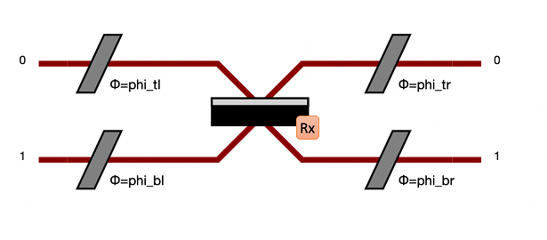

Components
==========

Overview
--------

.. list-table::
   :header-rows: 1
   :width: 100%

   * - Name
     - Object Name
     - ``PhysSkin`` display style
     - ``SymbSkin`` display style
     - Unitary Matrix
   * - :ref:`Beam Splitter`
     - ``BS``
     - .. image:: _static/library/phys/bs.png
     - .. image:: _static/library/symb/bs.png
     - Depends on the convention, see :ref:`Beam Splitter`
   * - :ref:`Phase Shifter`
     - ``PS``
     - .. image:: _static/library/phys/ps.png
     - .. image:: _static/library/symb/ps.png
     - :math:`\left[\begin{matrix}e^{i \phi}\end{matrix}\right]`
   * - :ref:`Permutation`
     - ``PERM``
     - .. image:: _static/library/phys/perm.png
     - .. image:: _static/library/symb/perm.png
     - Example of a two mode permutation: :math:`\left[\begin{matrix}0 & 1\\1 & 0\end{matrix}\right]`
   * - :ref:`Waveplate`
     - ``WP``
     - .. image:: _static/library/phys/wp.png
     - .. image:: _static/library/symb/wp.png
     - :math:`\left[\begin{matrix}i \sin{\left(\delta \right)} \cos{\left(2 \xi \right)} + \cos{\left(\delta \right)} & i \sin{\left(\delta \right)} \sin{\left(2 \xi \right)}\\i \sin{\left(\delta \right)} \sin{\left(2 \xi \right)} & - i \sin{\left(\delta \right)} \cos{\left(2 \xi \right)} + \cos{\left(\delta \right)}\end{matrix}\right]`
   * - :ref:`Polarizing Beam Splitter`
     - ``PBS``
     - .. image:: _static/library/phys/pbs.png
     - .. image:: _static/library/symb/pbs.png
     - :math:`\left[\begin{matrix}0 & 0 & 1 & 0\\0 & 1 & 0 & 0\\1 & 0 & 0 & 0\\0 & 0 & 0 & 1\end{matrix}\right]`
   * - :ref:`Polarization Rotator`
     - ``PR``
     - .. image:: _static/library/phys/pr.png
     - .. image:: _static/library/symb/pr.png
     - :math:`\left[\begin{matrix}\cos{\left(\delta \right)} & \sin{\left(\delta \right)}\\- \sin{\left(\delta \right)} & \cos{\left(\delta \right)}\end{matrix}\right]`
   * - :ref:`Time Delay`
     - ``TD``
     - .. image:: _static/library/phys/dt.png
     - .. image:: _static/library/symb/dt.png
     - `N/A`
   * - :ref:`Loss Channel`
     - ``LC``
     - .. image:: _static/library/phys/lc.png
     - .. image:: _static/library/symb/lc.png
     - `N/A`

Description
-----------

Beam Splitter
^^^^^^^^^^^^^

Beam splitters couple two spatial modes together, acting on :math:`\ket{1,0}` and :math:`\ket{0,1}`. Three specialized
conventions are defined, with a single :math:`\theta` parameter, as follow:

.. list-table::
   :header-rows: 1
   :width: 100%

   * - Convention
     - Unitary matrix
     - Default value (:math:`\theta=\pi/2`)
     - Comment
   * - ``Rx``
     - :math:`\left[\begin{matrix}\cos{(\theta/2)} & i \sin{(\theta/2)}\\i \sin{(\theta/2)} & \cos{(\theta/2)}\end{matrix}\right]`
     - :math:`\left[\begin{matrix}1 & i\\i & 1\end{matrix}\right]`
     - Symmetrical, default convention
   * - ``Ry``
     - :math:`\left[\begin{matrix}\cos{(\theta/2)} & -\sin{(\theta/2)}\\ \sin{(\theta/2)} & \cos{(\theta/2)}\end{matrix}\right]`
     - :math:`\left[\begin{matrix}1 & -1\\1 & 1\end{matrix}\right]`
     - Real, non symmetrical
   * - ``H``
     - :math:`\left[\begin{matrix}\cos{(\theta/2)} & \sin{(\theta/2)}\\ \sin{(\theta/2)} & -\cos{(\theta/2)}\end{matrix}\right]`
     - :math:`\left[\begin{matrix}1 & 1\\1 & -1\end{matrix}\right]`
     - Hadamard gate, ``HH=I``, non symmetrical

Each convention also accepts up to four additional phases, mimicing a phase shifter on each mode connected to the beam
splitter. For instance, with the ``Rx`` convention, the unitary matrix is defined by:

:math:`\left[\begin{matrix}e^{i(\phi_{tl}+\phi_{tr})} \cos{\left(\theta/2 \right)} & i e^{i (\phi_{tr}+\phi_{bl})} \sin{\left(\theta/2 \right)}\\i e^{i \left(\phi_{tl} + \phi_{br}\right)} \sin{\left(\theta/2 \right)} & e^{i (\phi_{br}+\phi_{bl})} \cos{\left(\theta/2 \right)}\end{matrix}\right]`

It is thus parametrized by :math:`\theta`, :math:`\phi_{tl}`, :math:`\phi_{bl}`, :math:`\phi_{tr}` and
:math:`\phi_{br}` angles, making this beam splitter equivalent to:

:math:`\theta` relates to the reflectivity and :math:`\phi` angles correspond to relative phases between modes.
Beam splitters exist as bulk, fibered and on-chip components.

The relationship between the reflectivity :math:`R` and :math:`\theta` is: :math:`cos {\left( \theta/2 \right)} = \sqrt{R}`.

To create a beam splitter object with a given reflectivity value:

>>> from perceval.components import BS
>>> R = 0.45
>>> beam_splitter = BS(BS.r_to_theta(R))

By default
``theta`` is :math:`\pi/2`,
``phi_tl`` is :math:`0`,
``phi_bl`` is :math:`0`,
``phi_tr`` is :math:`0`,
``phi_br`` is :math:`0`.
These values can be modified by using optional parameters when creating a ``BS`` object.

Loss Channel
^^^^^^^^^^^^

Loss channels are non unitary components applying a fixed loss on a given mode. It can seen as a beam splitter with
a reflectivity equal to the loss. This beam splitter being connected to a "virtual mode" containing lost photons.

A loss channel is not expressed as a unitary matrix and can only be used in processors.

Phase Shifter
^^^^^^^^^^^^^

A phase shifter adds a phase :math:`\phi` on a spatial mode, which corresponds to a Z rotation in the Bloch sphere.

The definition of a phase shifter uses the same (non-optional) parameter ``phi`` in both libraries ``symb`` and ``phys``.
To create a phase shifter ``PS`` object:

>>> import perceval.components.unitary_components as comp
>>> phase_shifter = comp.PS(sp.pi/2) # phi = pi/2

Permutation
^^^^^^^^^^^

A permutation exchanges multiple consecutive spatial modes.

To create a permutation ``PERM`` sending :math:`\ket{0,1}` to :math:`\ket{1,0}` and vice-versa:

>>> import perceval.components.unitary_components as comp
>>> permutation = comp.PERM([1, 0])

More generally one can define Permutation on an arbitrary number of modes.
The permutation should be described by a list of integers from 0 to :math:`l-1`, where :math:`l` is the length of the list.
The :math:`k` th spatial input mode is sent to the spatial output mode corresponding to the :math:`k` th value in the list.

For instance the following defines
a 4-mode permutation. It matches the first input path (index 0) with the third output path (value 2), the second input path with the fourth output path, the third input path, with the first output path, and the fourth input path with the second output path.

>>> import perceval as pcvl
>>> import perceval.components.unitary_components as comp
>>> c = comp.PERM([2, 3, 0, 1])
>>> pcvl.pdisplay(c)
>>> pcvl.pdisplay(c.compute_unitary(), output_format=pcvl.Format.LATEX)

.. list-table::

   * - .. image:: _static/library/phys/perm-2310.png
           :width: 180
     - .. math::
            \left[\begin{matrix}0 & 0 & 1 & 0\\0 & 0 & 0 & 1\\0 & 1 & 0 & 0\\1 & 0 & 0 & 0\end{matrix}\right]

Waveplate
^^^^^^^^^^

A waveplate acts on the polarisation modes of a single spatial mode. It is described by the following unitary:

.. math::
    \left[\begin{matrix}i \sin{\left(\delta \right)} \cos{\left(2 \xi \right)} + \cos{\left(\delta \right)} & i \sin{\left(\delta \right)} \sin{\left(2 \xi \right)}\\i \sin{\left(\delta \right)} \sin{\left(2 \xi \right)} & - i \sin{\left(\delta \right)} \cos{\left(2 \xi \right)} + \cos{\left(\delta \right)}\end{matrix}\right]

:math:`\delta` is a parameter proportional to the thickness of the waveplate and :math:`\xi` represents the angle of the waveplate's optical axis in the :math:`\left\{\ket{H}, \ket{V}\right\}` plane. Especially important is the case that :math:`\delta=\pi/2`, known as a half-wave plate, which rotates linear polarisations in the :math:`\left\{\ket{H}, \ket{V}\right\}` plane.

Polarizing Beam Splitter
^^^^^^^^^^^^^^^^^^^^^^^^

A polarising beam splitter converts a superposition of polarisation modes in a single spatial mode to the corresponding equal-polarisation superposition of two spatial modes,and vice versa, and so in this sense allow us to translate between polarisation and spatial modes. The unitary matrix associated to a polarising beam splitter acting on the tensor product of the spatial mode and the polarisation mode is:

.. math::
    \left[\begin{matrix}0 & 0 & 1 & 0\\0 & 1 & 0 & 0\\1 & 0 & 0 & 0\\0 & 0 & 0 & 1\end{matrix}\right]

Polarization Rotator
^^^^^^^^^^^^^^^^^^^^

A polarization rotator is an optical device that rotates the polarization axis of a linearly polarized light beam by an angle of choice.
Such devices can be based on the Faraday effect, on birefringence, or on total internal reflection.
Rotators of linearly polarized light have found widespread applications in modern optics since laser beams tend to be linearly polarized and it is often necessary to rotate the original polarization to its orthogonal alternative.

See https://en.wikipedia.org/wiki/Polarization_rotator for more details.

Time Delay
^^^^^^^^^^

Time Delay is a special component corresponding to a roll of optical fiber making as an effect to delay a photon.

Parameter of the Time Delay is the fraction of a period the delay should be.
For instance ``TD(2)`` will make a delay on the line corresponding to two periods.

A time delay is not expressed as a unitary matrix and can only be used in processors.
