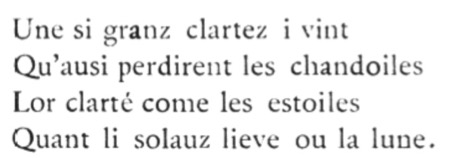

:github_url: https://github.com/Quandela/Perceval

   Perceval, the Story of the Grail – Chrétien de Troyes (circa 1180)

Welcome to the Perceval documentation!
======================================

Through a simple object-oriented Python API, Perceval provides tools for composing photonic circuits from linear optical components like beamsplitters and phase shifters,
defining single-photon sources, manipulating Fock states, and running simulations.

Perceval can be used to reproduce published experimental works or to
experiment directly with a new generation of quantum algorithms.

It aims to be a companion tool for developing photonic circuits –
for simulating and optimising their design,
modelling both the ideal and realistic behaviours, and proposing a normalised
interface to control them through the concept of *backends*.

Perceval is conceived as an object-oriented modular Python framework orgainised around the following elements:

* Tools to :ref:`build linear optical circuits <Circuits>` from a collection of pre-defined :ref:`components <Components>`
* Powerful :ref:`computing backends <Computing Backends>` implemented in C++
* A variety of technical utilities to manipulate:
   - :ref:`Fock states, state vectors and state vector distributions <States>`,
   - :ref:`unitary matrices <Matrices>`,
   - :ref:`parameters <Parameters>`.

It also includes transversal tools for flexible :ref:`visualization <Visualization>` of the circuits and results which are compatible
with notebooks or local development environments.

Perceval has been developed as a complete toolkit for physicists and computer scientists, and for students, researchers,
and practitioners of quantum computing.

If you are using Perceval for academic work, please cite the `Perceval white paper <https://arxiv.org/abs/2204.00602>`_ as:

.. code:: latex

    @article{heurtel2023perceval,
    doi = {10.22331/q-2023-02-21-931},
    url = {https://doi.org/10.22331/q-2023-02-21-931},
    title = {Perceval: {A} {S}oftware {P}latform for {D}iscrete {V}ariable {P}hotonic {Q}uantum {C}omputing},
    author = {Heurtel, Nicolas and Fyrillas, Andreas and Gliniasty, Gr{\'{e}}goire de and Le Bihan, Rapha{\"{e}}l and Malherbe, S{\'{e}}bastien and Pailhas, Marceau and Bertasi, Eric and Bourdoncle, Boris and Emeriau, Pierre-Emmanuel and Mezher, Rawad and Music, Luka and Belabas, Nadia and Valiron, Benoît and Senellart, Pascale and Mansfield, Shane and Senellart, Jean},
    journal = {{Quantum}},
    issn = {2521-327X},
    publisher = {{Verein zur F{\"{o}}rderung des Open Access Publizierens in den Quantenwissenschaften}},
    volume = {7},
    pages = {931},
    month = feb,
    year = {2023}
   }

.. toctree::
   :caption: Documentation
   :maxdepth: 2
   :hidden:

   basics
   usage
   circuits
   states
   polarization
   backends
   components
   tools
   algorithms
   legacy

.. toctree::
   :caption: Beginner tutorials
   :maxdepth: 2
   :hidden:

   notebooks/walkthrough-cnot
   notebooks/Tutorial

.. toctree::
   :caption: Advanced tutorials
   :maxdepth: 2
   :hidden:

   notebooks/BS-based_implementation
   notebooks/LOv_rewriting_rules
   notebooks/Simulation_non-unitary_components
   notebooks/Circuit_conversion_qiskit_myQLM
   notebooks/Remote_computing
   notebooks/Graph_States_generation_and_display

.. toctree::
   :caption: Boson sampling
   :maxdepth: 2
   :hidden:

   notebooks/Boson_sampling
   notebooks/MPS_techniques_for_boson_sampling

.. toctree::
   :caption: Standard quantum algorithms
   :maxdepth: 2
   :hidden:

   notebooks/Shor_Implementation
   notebooks/2-mode_Grover_algorithm

.. toctree::
   :caption: Variational quantum algorithms
   :maxdepth: 2
   :hidden:

   notebooks/Differential_equation_resolution
   notebooks/Variational_Quantum_Eigensolver
   notebooks/Reinforcement_learning
   notebooks/QUBO

.. toctree::
   :caption: Quantum walk
   :maxdepth: 2
   :hidden:

   notebooks/Two-particle_bosonic-fermionic_quantum_walk

.. toctree::
   :caption: Others
   :maxdepth: 2
   :hidden:

   notebooks/gedik_qudit

.. toctree::
   :caption: Code Reference
   :maxdepth: 2
   :hidden:

   reference/statevector
   reference/polarization
   reference/circuit
   reference/circuit_optimizer
   reference/utils
   reference/source
   reference/simulator
   reference/processor
   reference/postselect
   reference/qiskit_converter
   reference/stategenerator

.. toctree::
   :caption: Community

   contributing
   bibliography
