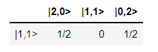

Analyzer
^^^^^^^^

The :code:`Analyzer` algorithm aims at testing an :ref:`Experiment`, computing a probability table between input states
and expected outputs, a performance score and an error rate, through a given :ref:`Computer`

For example, we call the Naive backend that we store in simulator_backend:

>>> simulator_backend = pcvl.BackendFactory().get_backend('Naive')

We can create an input state that will enter our optical scheme later on. We store it in `input_state` and use `BasicState`
from the Perceval library.

>>> input_state = pcvl.BasicState("|1,1>")

let's simulate the distribution obtained when we input two photons in a beam-splitter. We will use the Naive backend already stored in simulator_backend.

We will simulate the behavior of the circuit using the :code:`Analyzer` which has four arguments:

- The first one is an instance of the computer that we are going to use.
- The second one is the experiment to analyse.
- The third one is the input state (we will use `input_state`).
- The fourth one is the desired output states. To compute all possible output states, one just input `"*"`.

>>> experiment = pcvl.Experiment(pcvl.BS())  # No need to declare the input state here
>>> computer = pcvl.SimulatedComputer(simulator_backend)
>>> with computer.acquire():
...     ca = pcvl.algorithm.Analyzer(computer, experiment, [input_state], "*")

Then, we display the result of `Analyzer` via :ref:`pdisplay`.

>>> pcvl.pdisplay(ca)

.. autoclass:: perceval.algorithm.analyzer.Analyzer
   :members:
