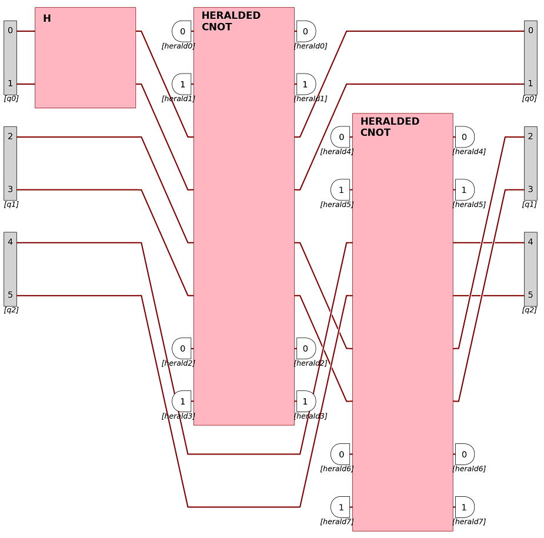

Experiment
^^^^^^^^^^

An :code:`Experiment` describes the elements of an optical table and the post-processing rules.

It can be created either using a circuit, a number of modes, or nothing,
in which case the size will be determined at the first component addition.

>>> import perceval as pcvl
>>> e = pcvl.Experiment(2, name="my experiment").add(0, pcvl.BS())

Experiment composition
----------------------

Components, circuits and other experiments can be added to experiments using the :meth:`add` method
(note however that :code:`//` doesn't work for experiments).

>>> e.add(0, pcvl.PS(3.14))  # Add a phase shifter on mode 0

However, unlike :ref:`Circuit`, non-linear components can also be added to Experiments.

>>> e.add(1, pcvl.TD(1))  # Adds a time-delay on mode 1

Secondly, the mode on which a component is added has a few more options than just an integer.
One can use a list or a dict of integers to map the output of the current experiment to the input of the added component.
If the left experiment has output ports and the right experiment has input ports, it can also be a dict describing the port names.

This adds up a permutation before inserting the new component, and its inverse at the end (so modes don't move when doing this).
Note however that when adding an experiment with asymmetrical heralds (see below),
the inverse permutation is not added since it doesn't exist, so modes might move (check with a :code:`pdisplay`).

>>> e.add([1, 0], pcvl.BS(theta=0.7))  # Left mode 1 will connect to right mode 0, and left mode 0 will connect to right mode 1
>>> e.add({1: 0, 0: 1}, pcvl.BS(theta=0.7))  # Same as above

Composition is a powerful tool to achieve complex experiments:

    An experiment composed of a Hadamard gate and two heralded CNOT gates.

Detectors can also be added to an Experiment using the same syntax

>>> e.add(0, pcvl.Detector.threshold())

Once a :code:`Detector` has been added, no optical component can be added anymore on this mode.

Setting an input state
----------------------

Before an Experiment can be simulated, an input state must be provided.

>>> e.with_input(pcvl.BasicState([1, 0]))

The input state can be:

- A :code:`BasicState`, in which case the noise from the noise model is computed.
- A :code:`LogicalState` if ports have been defined, in which case the noise is computed.
- A :code:`StateVector`
- A :code:`SVDistribution`

Min photons filter
------------------

A threshold on the number of detected photons can be set so outputs having less than this number of photons are filtered out.
This has an impact on the perfs of the Experiment when computed with a :ref:`Computer`.

>>> e.min_detected_photons_filter(3)  # Outputs will all have at least 3 photons

Ports
-----

Once an Experiment has been defined in terms of components, one can add ports and heralds to it.
If a port spans over several modes, the specified mode is considered to be the upper one.

>>> e.add_port(0, pcvl.Port(pcvl.Encoding.DUAL_RAIL, "qubit0"))  # Adds a dual rail port on modes 0 and 1 on both sides
>>> e.remove_port(0)
>>> e.add_port(0, pcvl.Port(pcvl.Encoding.DUAL_RAIL, "qubit0"), location=pcvl.PortLocation.INPUT)  # Add the port on the left of the experiment

Ports have three main purposes:

- Showing the circuit's logic in display
- Composing experiments using ports
- Setting an input state

>>> e.with_input(pcvl.LogicalState([0]))  # Equivalent to BasicState([1, 0]) for a dual rail. Adapts automatically to the ports

Heralds
-------

Heralds are a special kind of ports that act as modes that the user "doesn't want to see".
Note that ports and heralds are mutually exclusive mode-wise.
At the input, they declare a number of photon in a mode that the user won't have to specify when using :code:`with_input`.

>>> e = pcvl.Experiment(pcvl.BS())
>>> e.add_herald(0, 1, location=pcvl.PortLocation.INPUT)  # Add an herald of value 1 on input mode 0
>>> e.with_input(pcvl.BasicState([1]))  # Only one mode
>>> e.m_in
1
>>> e.heralds_in
{0: 1}

The input heralds can be removed from a state using :code:`state = remove_in_heralded_modes(state)`.

At the output, they will automatically filter states so only states matching the given number of photons will be selected.
They also remove these modes from the resulting BasicStates.
This filtering has an impact on the perf of the experiment.

>>> e = pcvl.Experiment("SLOS", pcvl.BS())
>>> e.add_herald(0, 1, location=pcvl.PortLocation.OUTPUT)  # Output will have only one mode
>>> e.m
1
>>> e.circuit_size  # Real size of the circuit
2
>>> e.heralds
{0: 1}

Heralded output modes can still be seen when simulating using a :ref:`Simulator` using :code:`simulator.keep_heralds(True)`.
In this case, heralded modes can still be removed afterward using :code:`state = e.remove_heralded_modes(state)`
Heralds at output are independent from the min detected photons filter, as the filter looks only at non-heralded modes.

>>> e.min_detected_photons_filter(2)
>>> e.add_herald(0, 1)  # There will actually be at least 3 photons

An :code:`Experiment` that has at least one mode that defines an herald only at input or output is considered asymmetrical.
By default, heralds are added on both sides, so Experiments are kept symmetrical.

When composing experiments, the experiments are considered to have :code:`m` output modes and :code:`m_in` input modes.
Heralds are considered to be outside the experiments. Thus, they can be moved to new modes to keep a good structure.
Most 2-qubit gates from the catalog are symmetrical experiments that use heralds.

When composing with a symmetrical experiment, the inverse permutation is added at the right to keep the order of the modes.
This is not the case when composing with an asymmetric experiment.

>>> from perceval import catalog
>>> e = pcvl.Experiment("SLOS", 4)
>>> cnot = catalog["postprocessed cnot"].build_experiment()
>>> cnot.m
4
>>> cnot.circuit_size
6
>>> e.add(0, cnot)  # Works despite the cnot having 6 modes
>>> e.circuit_size  # e is now bigger due to the added heralds from cnot
6
>>> e.heralds
{4: 0, 5: 0}

PostSelect
----------

A post-selection method can be added to an Experiment to filter only states matching it.

>>> e.set_postselection(pcvl.PostSelect("[0, 1] == 2"))
>>> e.post_select_fn
[0, 1] == 2

When composing, the modes are swapped to match the new modes of the composition.
Also, it is not allowed to add something to an experiment that has a post-selection
if the modes overlap one of the nodes of the post-selection (they should be entirely included or disjoint)

If the user knows what they are doing,
they can remove the post-selection using :code:`e.clear_postselection()` then apply it again.

.. autoclass:: perceval.components.experiment.Experiment
   :members:
