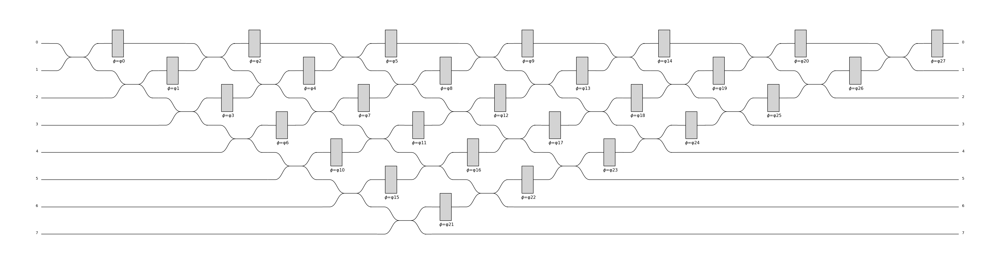

Generic Interferometer
^^^^^^^^^^^^^^^^^^^^^^

GenericInterferometer usage example
===================================

It is possible to define a generic interferometer with the class
:class:`perceval.components.GenericInterferometer`.

For instance, the following defines a triangular interferometer on 8 modes using a beam splitter
and a phase shifter as base components:

>>> c = pcvl.GenericInterferometer(8,
...                                lambda i: comp.BS() // comp.PS(pcvl.P("φ%d" % i)),
...                                shape=pcvl.InterferometerShape.TRIANGLE)
>>> pcvl.pdisplay(c)

GenericInterferometer code reference
====================================

.. autoenum:: perceval.utils._enums.InterferometerShape

.. autoclass:: perceval.components.generic_interferometer.GenericInterferometer
   :members:
