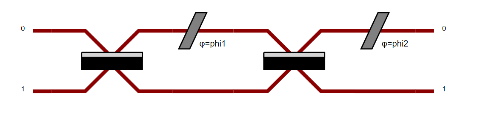

pdisplay
========

Also known as "Perceval pretty display", is a generic function designed to display a lot of different types of Perceval
objects.

Display a circuit
^^^^^^^^^^^^^^^^^

Any circuit coded in perceval can be displayed.
You just need to make the code associated with the desired circuit, let's call it circ, and add pcvl.pdisplay(circ) afterwards in the python cell.

Let's do an example to understand: you want to display the Mach-Zendher Interferometer.

Start by doing the code associated to the circuit.

.. code-block::

  import perceval.components.unitary_components as comp

  mzi = (pcvl.Circuit(m=2, name="mzi")
        .add((0, 1), comp.BS())
        .add(0, comp.PS(pcvl.Parameter("phi1")))
        .add((0, 1), comp.BS())
        .add(0, comp.PS(pcvl.Parameter("phi2"))))

Then, add ``pcvl.pdisplay()`` of your circuit.

.. code-block::

  pcvl.pdisplay(mzi)

.. tip::

    The outcome of this last command will depend on your environment.

    .. list-table::
       :header-rows: 1
       :width: 100%

       * - Text Console
         - Jupyter Notebook
         - IDE (Pycharm, Spyder, etc)
       * - .. image:: ../_static/img/terminal-screenshot.jpg
         - .. image:: ../_static/img/jupyter-screenshot.jpg
         - .. image:: ../_static/img/ide-screenshot.jpg

Also, you can change the display of the circuit using a different skin which can itself be configured.
Indeed, a boolean can be set to obtain a more compact display (if the circuit is too wide for example).

.. code-block::

  import perceval as pcvl
  import perceval.components.unitary_components as comp
  from perceval.rendering.circuit import SymbSkin

  C = pcvl.Circuit.decomposition(pcvl.Matrix(comp.PERM([3, 1, 0, 2]).U),
  comp.BS(R=pcvl.P("R")), phase_shifter_fn=comp.PS)
  symbolic_skin = SymbSkin(compact_display=True)
  pcvl.pdisplay(C, skin=symbolic_skin)

.. code-block::

  symbolic_skin = SymbSkin(compact_display=False)
  pcvl.pdisplay(C, skin=symbolic_skin)

By default the skin will be ``PhysSkin``, if you want to use another skin by default, you can save your configuration into your Perceval persistent configuration.

In order to do that you need to use the object ``DisplayConfig`` like that:

.. code-block::

  from perceval.rendering.circuit import DisplayConfig, SymbSkin
  DisplayConfig.select_skin(SymbSkin) # SymbSkin will be used by default by pdisplay if no other skin is defined.
  DisplayConfig.save() # Will save the current DisplayConfig into your Perceval persistent configuration.

Code reference
^^^^^^^^^^^^^^

.. automodule:: perceval.rendering.pdisplay
   :members:

.. autoclass:: perceval.rendering.circuit.DisplayConfig
   :members:
   :inherited-members:
