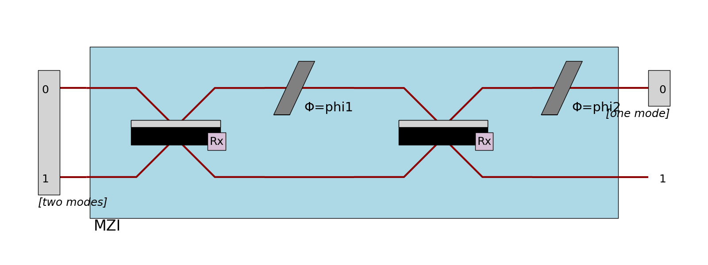
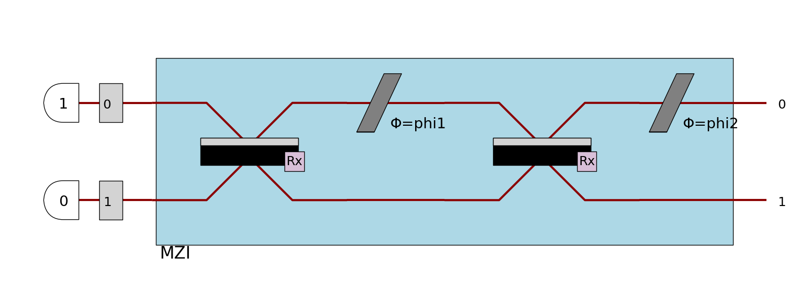

pdisplay
========

Also known as "Perceval pretty display", is a generic function designed to display a lot of different types of Perceval
objects.

This method has two variants:

- :code:`pdisplay` that displays the object immediately.
  The format and place of output might depend on where your code is executed (IDE, notebook...) and the kind of object that is displayed.
- :code:`pdisplay_to_file` that doesn't display the object but saves its representation in a file specified by a string path.
  This method always uses :code:`Format.MPLOT` (for matplotlib) by default,
  so you might need to specify it by hand it for some objects.

Display a circuit
^^^^^^^^^^^^^^^^^

Any circuit coded in perceval can be displayed.
You just need to make the code associated with the desired circuit, let's call it circ, and add pcvl.pdisplay(circ) afterwards in the python cell.
Note that components follow the same rules than circuits for displaying.

Let's do an example to understand: you want to display the Mach-Zendher Interferometer.

Start by doing the code associated to the circuit.

.. code-block::

  import perceval.components.unitary_components as comp

  mzi = (pcvl.Circuit(m=2, name="mzi")
        .add((0, 1), comp.BS())
        .add(0, comp.PS(pcvl.Parameter("phi1")))
        .add((0, 1), comp.BS())
        .add(0, comp.PS(pcvl.Parameter("phi2"))))

Then, add ``pcvl.pdisplay()`` of your circuit.

.. code-block::

  pcvl.pdisplay(mzi)

.. figure:: ../../_static/img/mzi.png
  :align: center
  :width: 75%

.. tip::

    The outcome of this last command will depend on your environment.

    .. list-table::
       :header-rows: 1
       :width: 100%

       * - Text Console
         - Jupyter Notebook
         - IDE (Pycharm, Spyder, etc)
       * - .. image:: ../../_static/img/terminal-screenshot.jpg
         - .. image:: ../../_static/img/jupyter-screenshot.jpg
         - .. image:: ../../_static/img/ide-screenshot.jpg

Also, you can change the display of the circuit using a different skin which can itself be configured.
Indeed, a boolean can be set to obtain a more compact display (if the circuit is too wide for example).

.. code-block::

  import perceval as pcvl
  import perceval.components.unitary_components as comp
  from perceval.rendering.circuit import SymbSkin

  C = pcvl.Circuit.decomposition(pcvl.Matrix(comp.PERM([3, 1, 0, 2]).U),
  comp.BS(R=pcvl.P("R")), phase_shifter_fn=comp.PS)
  symbolic_skin = SymbSkin(compact_display=True)
  pcvl.pdisplay(C, skin=symbolic_skin)

.. figure:: ../../_static/img/decomposition_symb_compact.png
  :align: center
  :width: 40%

.. code-block::

  symbolic_skin = SymbSkin(compact_display=False)
  pcvl.pdisplay(C, skin=symbolic_skin)

.. figure:: ../../_static/img/decomposition_symb_compact_false.png
  :align: center
  :width: 50%

By default the skin will be ``PhysSkin``, if you want to use another skin by default, you can save your configuration
into your Perceval persistent configuration.

To save configuration for your choice of skin by default, you require the :ref:`DisplayConfig` object.

The possible kwargs when displaying a :code:`Circuit` are

- :code:`output_format`. The format to use for the output, from the :code:`Perceval.Format` enum.
  The available formats are MPLOT (default), TEXT and LATEX.
- :code:`recursive`. If :code:`True`, the first layer of inner circuits will be exposed in the rendering.
- :code:`compact`. If no skin is provided, the skin taken from the :code:`DisplayConfig` will have this value for :code:`compact_display`
- :code:`precision`. The numerical precision to display.
- :code:`nsimplify`. If :code:`True` (default), some values will be displayed with known mathematical values (pi, sqrt, fractions) if close enough
- :code:`skin`. The skin to use. If none is provided, the skin from the :code:`DisplayConfig` will be used.

Display a Processor
^^^^^^^^^^^^^^^^^^^

Like circuits, :code:`Processor` can also be displayed using :code:`pdisplay`.
Note that the behaviour is strictly the same for :code:`Experiment` and :code:`RemoteProcessor`.

For a :code:`Processor` containing only a circuit, the result is the same as for displaying a :code:`Circuit`.

However, some objects defined in the :code:`Processor` will also be displayed if defined, modifying the look of the results.
Every object that can be named will display its name near to where it is shown.

We take the same example as before for this demonstration.

Ports
-----

When defined, ports are represented by encapsulating the mode numbers in rectangles.

>>> proc = pcvl.Processor("SLOS", mzi)
>>> proc.add_port(0, pcvl.Port(pcvl.Encoding.DUAL_RAIL, "two modes"), location=pcvl.PortLocation.INPUT)
>>> proc.add_port(0, pcvl.Port(pcvl.Encoding.RAW, "one mode"), location=pcvl.PortLocation.OUTPUT)
>>> pcvl.pdisplay(proc, recursive=True)

Detectors
---------

When defined, detectors are displayed at the right of the circuit with different shapes to be more recognizable:

- PNR detectors are represented by a half-circle
- PPNR detectors are represented by a polygon
- threshold detectors are represented by a triangle

>>> proc = pcvl.Processor("SLOS", 3).add(0, mzi)
>>> proc.add(0, pcvl.Detector.pnr())
>>> proc.add(1, pcvl.Detector.ppnr(24))
>>> proc.add(2, pcvl.Detector.threshold())
>>> pcvl.pdisplay(proc, recursive=True)

Notice that in that case, the mode number is shown as if there was a single-mode port.

Also, if there are components after detectors (such as feed-forward configurators),
the color of the optical path will change to indicate that this mode is now a classical mode.

Heralds
-------

When defined, heralds are displayed using half-circles with their value inside the circle.
Also, they hide a part of the optical path to be as close as possible to the components they are used in.
The modes numbers on which the heralds are defined are not shown.

>>> proc = pcvl.Processor("SLOS", mzi)
>>> proc.with_input(pcvl.BasicState([1, 0]))
>>> pcvl.pdisplay(proc, recursive=True)

In case a detector is defined on the same mode than an herald, the half-circle is replaced by the shape of the detector.
Notice that for PNR detectors, the shape doesn't change, but the number of expected photons is added into the half-circle.

Input state
-----------

If possible, the photons of the input state will be displayed at the left of the processor.
This is globally the case when the input state is a :code:`BasicState`, and the processor is displayed in a SVG format.

>>> proc = pcvl.Processor("SLOS", mzi)
>>> proc.with_input(pcvl.BasicState([1, 0]))
>>> pcvl.pdisplay(proc, recursive=True)

Notice that in this case, the modes are displayed as if they had a single-mode port (if no port is defined),
and the photons are displayed like heralds except that they don't hide the mode.

Displaying a Matrix
^^^^^^^^^^^^^^^^^^^

Matrices, both numeric and symbolic, can be displayed using :code:`pdisplay`

>>> m = Matrix([[1, 2], ["x/2", np.pi]], use_symbolic=True)
>>> pcvl.pdisplay(m)
⎡1    2 ⎤
⎣x/2  pi⎦

The possible kwargs when displaying a :code:`Matrix` are

- :code:`output_format`. The format to use for the output, from the :code:`Perceval.Format` enum.
  The available formats are TEXT (default), and LATEX.
- :code:`precision`. The numerical precision to display numbers.

Displaying a DensityMatrix
^^^^^^^^^^^^^^^^^^^^^^^^^^

Density matrices are displayed differently than regular matrices.
Instead of a table, :code:`pdisplay` uses matplotlib to represent them using a 2d plot where pixels represent the amplitudes of different states.

See :ref:`Density matrices in Fock space`

The possible kwargs when displaying a :code:`DensityMatrix` are:

- :code:`color`. If :code:`True` (default), the result is a color image where colors represent the phase of the states.
- :code:`cmap`. Any colormap from matplotlib as a str to use to represent the phase of the states.

Displaying a distribution
^^^^^^^^^^^^^^^^^^^^^^^^^

:code:`StateVector`, :code:`BSCount`, :code:`BSDistribution` and :code:`SVDistribution`
can be displayed in a table format using :code:`pdisplay`,
the behaviour being similar for all these classes.

All of them are normalized before being displayed.

>>> state = pcvl.StateVector([1, 0]) + 1j * pcvl.StateVector([0, 1])
>>> pcvl.pdisplay(state)
+-------+-------------+
| state | prob. ampl. |
+-------+-------------+
| |1,0> |  sqrt(2)/2  |
| |0,1> | I*sqrt(2)/2 |
+-------+-------------+

The main use of this display is that it can sort the keys by value and display only a limited number of keys,
allowing the display to be fast and to keep only the most important information.

>>> bsd = pcvl.BSDistribution({pcvl.BasicState([0]): 0.1, pcvl.BasicState([1]): 0.7, pcvl.BasicState([2]): 0.2})
>>> pcvl.pdisplay(bsd, max_v=2)  # Sort by default, keep only the 2 highest values
+-------+-------------+
| state | probability |
+-------+-------------+
|  |1>  |    7/10     |
|  |2>  |     1/5     |
+-------+-------------+

The possible kwargs when displaying a :code:`StateVector`, :code:`BSCount`, :code:`BSDistribution` or :code:`SVDistribution` are

- :code:`output_format`. The format to use for the output, from the :code:`Perceval.Format` enum.
  The available formats are TEXT (default), LATEX and HTML.
- :code:`nsimplify`. If :code:`True` (default), some values will be displayed with known mathematical values (pi, sqrt, fractions) if close enough
- :code:`precision`. The numerical precision to display numbers.
- :code:`max_v`. The number of values to display.
- :code:`sort`. If :code:`True` (default), values will be sorted before being displayed.

Displaying samples
^^^^^^^^^^^^^^^^^^

:code:`BSSamples` can be displayed in a table format using :code:`pdisplay`.

>>> bs_samples = pcvl.BSSamples()
>>> bs_samples.append(perceval.BasicState("|1,0>"))
>>> bs_samples.append(perceval.BasicState("|1,1>"))
>>> bs_samples.append(perceval.BasicState("|0,1>"))
>>> pcvl.pdisplay(bs_samples)
+--------+
| states |
+--------+
| |1,0>  |
| |1,1>  |
| |0,1>  |
+--------+

The number of displayed states can be limited with the parameter :code:`max_v`.

>>> pcvl.pdisplay(bs_samples, max_v=2)  # keep only the 2 first values
+--------+
| states |
+--------+
| |1,0>  |
| |1,1>  |
+--------+

The possible kwargs when displaying a :code:`BSSamples` are

- :code:`output_format`. The format to use for the output, from the :code:`Perceval.Format` enum.
  The available formats are TEXT (default), LATEX and HTML.
- :code:`max_v`. The number of values to display. :code:`max_v` is 10 by default.

Displaying algorithms
^^^^^^^^^^^^^^^^^^^^^

Some algorithms can be passed to :code:`pdisplay` to display their results easily.

Analyzer
--------

In the case of the :code:`Analyzer`, it displays the results as a table, as well as the performance and fidelity of the gate.
See usage in :ref:`Ralph CNOT Gate`.

The possible kwargs when displaying an :code:`Analyzer` are:

- :code:`output_format`. The format to use for the output, from the :code:`Perceval.Format` enum.
  The available formats are TEXT (default), LATEX and HTML.
- :code:`nsimplify`. If :code:`True` (default), some values will be displayed with known mathematical values (pi, sqrt, fractions) if close enough
- :code:`precision`. The numerical precision to display numbers.

Tomography
----------

In the case of a tomography algorithm, it displays the results as a table, as well as the performance and fidelity of the gate.
See usage in :ref:`Tomography of a CNOT Gate`.

The possible kwargs when displaying a tomography algorithm are:

- :code:`precision`. The numerical precision to display numbers.
- :code:`render_size`. The size to create the matplotlib figure.

Display a JobGroup
^^^^^^^^^^^^^^^^^^

:code:`pdisplay` can be used to represent a :code:`JobGroup`.
The result is a table showing a resume of the status of the jobs inside the job group.

>>> jg = pcvl.JobGroup("example")  # Result might change depending on what is in this group
>>> pcvl.pdisplay(jg)
+--------------+-------+--------------------------------------+
| Job Category | Count |               Details                |
+--------------+-------+--------------------------------------+
|    Total     |   8   |                                      |
|   Finished   |   5   | {'successful': 4, 'unsuccessful': 1} |
|  Unfinished  |   3   |      {'sent': 1, 'not sent': 2}      |
+--------------+-------+--------------------------------------+

The possible kwargs when displaying a tomography algorithm are:

- :code:`output_format`. The format to use for the output, from the :code:`Perceval.Format` enum.
  The available formats are TEXT (default), LATEX and HTML.

Display a graph
^^^^^^^^^^^^^^^

:code:`pdisplay` offers support to quickly display graphs from :code:`nx.graph`.

The possible kwargs when displaying a graph are:

- :code:`output_format`. The format to use for the output, from the :code:`Perceval.Format` enum.
  The available formats are MPLOT (default), and LATEX.

Code reference
^^^^^^^^^^^^^^

.. automodule:: perceval.rendering.pdisplay
   :members:

.. autoenum:: perceval.rendering.format.Format
   :members:
