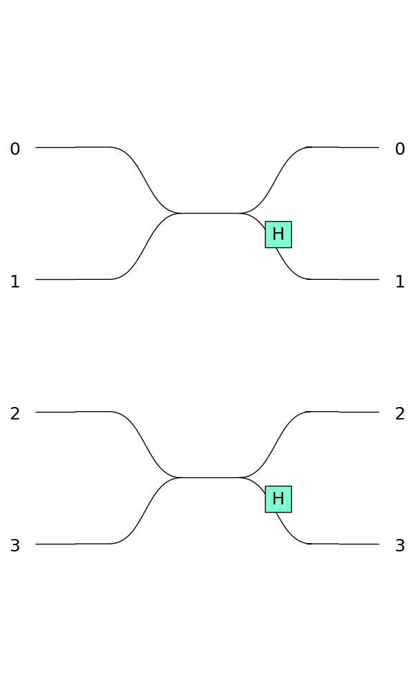

Circuit rendering skins
^^^^^^^^^^^^^^^^^^^^^^^

When rendering a :ref:`Circuit`, an :ref:`Experiment` or a :ref:`Processor`, you can select a skin which will change how
the components are displayed.

>>> import perceval as pcvl
>>> c = pcvl.Circuit(4).add(0, pcvl.BS.H()).add(2, pcvl.BS.H())
>>> pcvl.pdisplay(c, skin = pcvl.SymbSkin(compact_display = True))

Perceval provides two skins for an easy usage:

* :code:`SymbSkin`: a sober black and white skin
* :code:`PhysSkin`: a more colorful "real-life" skin (default one)

Both share the same init signature,
with an optional boolean kwarg :code:`compact_display` that makes the circuit components smaller and closer to each other.

Skin classes can be selected to be used across several perceval runs using the :ref:`DisplayConfig`.

>>> from perceval.rendering import DisplayConfig, SymbSkin
>>> DisplayConfig.select_skin(SymbSkin) # SymbSkin will be used by default by pdisplay if no other skin is defined.
>>> DisplayConfig.save() # Will save the current DisplayConfig into your Perceval persistent configuration.

Note that since the :ref:`DisplayConfig` class stores a skin class and not an instance, the `compact_display` attribute
needs to be given again each time.

It's also possible to hack an existing skin to fit your needs or even create a new one by subclassing the :code:`ASkin` abstract class,
though it will not be easy to save it.

Perceval also provides a :code:`DebugSkin` that builds on :code:`PhysSkin`,
but that also displays the heralded modes of an Experiment, and highlights whether phase shifters are defined or not.
As its name suggests, this skin should only be used when debugging as it is not made for a pretty and readable display.

Skin code reference
===================

All skins follow the :code:`ASkin` interface, except for the :meth:`__init__()` where subclasses already have their own style:

.. autoclass:: perceval.rendering.circuit.abstract_skin.ASkin
   :members:
