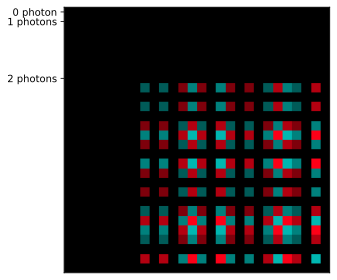

DensityMatrix
=============

An other way of representing mixed states is through the Density Matrices formalism. You can create a density matrix from
any 2-D array-like object and a mapping between the ``BasicStates`` and the indices of your array. Otherwise you can give a number of modes and photons
and a mapping will be generated according to the ``FockBasis`` object. The easiest way to generate Density matrices remains to give any other quantum state
class instance to the method ``from_svd()``.

Many of the above methods extends to Density Matrices, such as ``sample`` and ``measure``. This class is also suited for non unitary evolution of the state.
For example, the ``apply_loss`` method is already build-in to simulate the probabilistic loss of photons. It is also handled by the simulator for unitary evolutions
with the method ``evolve_density_matrix``.

The ``pdisplay()`` function also allows to easily see the coherence of your state by highlighting the non diagonal coefficients. For example, here is the resulting density matrix
when we try to create a bell state with a Post-Selected CNOT:

And below, the result of the same circuit, but with a noisy ``Source``. We can see the presence of FockStates with a smaller number of photons.

.. figure:: ../../_static/img/bell_noisy.svg
   :scale: 10 %
   :align: center

.. autoclass:: perceval.utils.density_matrix.DensityMatrix
   :members:
