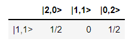

Tools
=====

Parameters
----------

Parameters are to way to parameterize circuits - See :ref:`Parameter` for the full class documentation.

Defining Parameters and reading/writing their values
^^^^^^^^^^^^^^^^^^^^^^^^^^^^^^^^^^^^^^^^^^^^^^^^^^^^

To define a parameter - just do:

>>> alpha = perceval.P("alpha")

When defining the parameter, you can also set its value, and max/min values and periodicity:

>>> alpha = perceval.P("phi", min_v=0, max_v=2*np.pi, periodic=True)

defining boundaries and periodicity is used in particular when optimizing a parameterized circuit.

Using parameters in a circuit
^^^^^^^^^^^^^^^^^^^^^^^^^^^^^

When a parameter is defined, you can use it within a circuit:

>>> c = phys.BS(theta=alpha)

You can use it several times and define other parameters dynamically:

>>> c = phys.BS(theta=alpha) // phys.PS(pcvl.P("phi")) // phys.BS(theta=alpha)

.. note::
  If you declare two parameters with the same name, they are not refering to the same variable, and to avoid confusion
  you can not use them simultaneously in a same circuit - the following is incorrect:

  >>> c = phys.BS(theta=pcvl.P("alpha")) // phys.PS(pcvl.P("phi")) // phys.BS(theta=pcvl.P("alpha"))

You can retrieve the parameters used in a circuit as following:

>>> params = c.get_parameters()
[Parameter(name='alpha_1', value=None, min=0.0, max=6.283185307179586),
 Parameter(name='phi', value=None, min=0.0, max=6.283185307179586),
 Parameter(name='alpha2', value=None, min=0.0, max=6.283185307179586)]

Setting Values
^^^^^^^^^^^^^^

To give a value to a parameter, use ``set_value``:

>>> alpha.set_value(np.pi/4)

The parameter is then *defined* and its value will be used when calculating circuit unitary:

>>> alpha.defined
True
>>> pcvl.pdisplay(c.compute_unitary(use_symbolic=False))
⎡sqrt(2)/2  sqrt(2)/2 ⎤
⎣sqrt(2)/2  -sqrt(2)/2⎦

To "forget" the value and turn back the parameter into a variable, use ```reset`` - or ``reset_parameters`` for a
circuit

>>> c.reset_parameters()

Visualization
-------------
In Perceval, to display anything, we use ``pcvl.pdisplay()``.

Display a circuit
^^^^^^^^^^^^^^^^^

Any circuit coded in perceval can be displayed.
You just need to make the code associated with the desired circuit, let's call it circ, and add pcvl.pdisplay(circ) afterwards in the python cell.

Let's do an example to understand : you want to display the Mach-Zendher Interferometer with the ``phys`` library.

Start by doing the code associated to the circuit.

>>> import perceval.lib.phys as phys
>>> mzi = (pcvl.Circuit(m=2, name="mzi")
...        .add((0, 1), phys.BS())
...        .add(0, phys.PS(pcvl.Parameter("phi1")))
...        .add((0, 1), phys.BS())
...        .add(0, phys.PS(pcvl.Parameter("phi2"))))

Then, add ``pcvl.pdisplay()`` of your circuit.

>>> pcvl.pdisplay(mzi)

.. figure:: _static/img/mzi.png
  :align: center
  :width: 75%

Also, a parameter can change the display of the circuit. Indeed, pdisplay can call a boolean compact option
which allows to compact the circuit if it is too wide for example. Thus, its display is clearer.

>>> import perceval as pcvl
>>> import perceval.lib.symb as symb
... C = pcvl.Circuit.decomposition(pcvl.Matrix(symb.PERM([3, 1, 0, 2]).U),
... symb.BS(R=pcvl.P("R")),phase_shifter_fn=symb.PS)

>>> pcvl.pdisplay(C, compact=True)

.. figure:: _static/img/decomposition_symb_compact.png
  :align: center
  :width: 25%

>>> pcvl.pdisplay(C, compact=False)

.. figure:: _static/img/decomposition_symb_compact_false.png
  :align: center
  :width: 25%


Matrices
^^^^^^^^

With Perceval, you can also display the matrix associated to your circuit.

>>> pcvl.pdisplay(mzi.U)

.. figure:: _static/img/mzi_matrix.png
  :align: center
  :width: 40%


CircuitAnalyser
^^^^^^^^^^^^^^^

With Perceval, we can use ``CircuitAnalyser`` to analyse the circuit and compute the associated output probabilities.

For example, we call the Naive backend that we store in simulator_backend:

>>> simulator_backend = pcvl.BackendFactory().get_backend('Naive')

We can create an input state that will enter our optical scheme later on. We store it in `input_state` and use `BasicState`
from the Perceval library.

>>> input_state = pcvl.BasicState("|1,1>")

let's simulate the distribution obtained when we input two photons in a beam-splitter. We will use the Naive backend already stored in simulator_backend.

We will simulate the behaviour of the circuit using the class `Circuit Analyser` which has three arguments:

- The first one is an instance of the simulator applied to the transfer matrix of the circuit.
- The second one is the input state (we will use `input_state`).
- The third one is the desired output states. To compute all possible output states, one just input `"*"`.
>>> sim = simulator_backend(phys.BS().U)        # create an instance of the simulator applied to the transfer matrix of the circuit
... ca = pcvl.CircuitAnalyser(sim,
                          [input_state],
                          "*")

Then, we display the result of `Circuit Analyser` via `pdisplay`.

>>> pcvl.pdisplay(ca)


