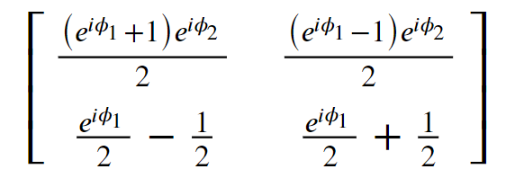

Tools
=====

Parameters
----------

Parameters are to way to parameterize circuits - See :ref:`Parameter` for the full class documentation.

Defining Parameters and reading/writing their values
^^^^^^^^^^^^^^^^^^^^^^^^^^^^^^^^^^^^^^^^^^^^^^^^^^^^

To define a parameter - just do:

>>> alpha = perceval.P("alpha")

When defining the parameter, you can also set its value, and max/min values and periodicity:

>>> alpha = perceval.P("phi", min_v=0, max_v=2*math.pi, periodic=True)

defining boundaries and periodicity is used in particular when optimizing a parameterized circuit.

Using parameters in a circuit
^^^^^^^^^^^^^^^^^^^^^^^^^^^^^

When a parameter is defined, you can use it within a circuit:

>>> c = BS(theta=alpha)

You can use it several times and define other parameters dynamically:

>>> c = BS(theta=alpha) // PS(pcvl.P("phi")) // BS(theta=alpha)

.. note::
  If you declare two parameters with the same name, they are not referring to the same variable, and to avoid confusion
  you can not use them simultaneously in a same circuit - the following is incorrect:

  >>> c = BS(theta=pcvl.P("alpha")) // PS(pcvl.P("phi")) // BS(theta=pcvl.P("alpha"))

You can retrieve the parameters used in a circuit as following:

>>> params = c.get_parameters()
[Parameter(name='alpha_1', value=None, min=0.0, max=6.283185307179586),
 Parameter(name='phi', value=None, min=0.0, max=6.283185307179586),
 Parameter(name='alpha2', value=None, min=0.0, max=6.283185307179586)]

Setting Values
^^^^^^^^^^^^^^

To give a value to a parameter, use ``set_value``:

>>> alpha.set_value(math.pi/4)

The parameter is then *defined* and its value will be used when calculating circuit unitary:

>>> alpha.defined
True
>>> pcvl.pdisplay(c.compute_unitary(use_symbolic=False))
⎡sqrt(2)/2  sqrt(2)/2 ⎤
⎣sqrt(2)/2  -sqrt(2)/2⎦

To "forget" the value and turn back the parameter into a variable, use ```reset`` - or ``reset_parameters`` for a
circuit

>>> c.reset_parameters()

Visualization
-------------

Perceval offers a high level function, ``pcvl.pdisplay()``, to display circuits and other objects.

See :ref:`pdisplay`

Logging messages
----------------

Perceval offers a log management package, ``pcvl.utils.logger``, to log messages.

See :ref:`Logging`


Matrices
^^^^^^^^

With Perceval, you can also display the matrix associated to your circuit.

>>> pcvl.pdisplay(mzi.U)




Random numbers
--------------

To achieve a reproducible result, for example in notebook execution, the pcvl.random_seed() function can be used at the beginning of the program.
This function ensures that any random numbers in the optimisation or random parameter generation functions will be reproducible from run to run.

Let's do a small example to understand:

>>> pcvl.random_seed(2)
>>> print(random.random())
0.9478274870593494
>>> print(random.random())
0.9560342718892494

>>> pcvl.random_seed(2)
>>> print(random.random())
0.9478274870593494
>>> print(random.random())
0.9560342718892494

Since the seeds of the 2 cells are identical, the randomly generated numbers are also equal.
It works the same way with notebook results.
